# ERNativeUI

  <strong>One native UI host. Multiple client mods. A menu that belongs in Elden Ring.</strong>

  <a href="https://github.com/Flammrock/ERNativeUI/releases/latest">Download</a>
  · <a href="https://www.nexusmods.com/eldenring/mods/10767">Nexus Mods</a>
  · <a href="docs/README.md">Documentation</a>
  · <a href="docs/getting-started/first-mod.md">Build your first mod</a>
  · <a href="examples/README.md">Examples</a>

ERNativeUI lets mod authors add settings and interactions directly to Elden
Ring's native interface. One process-wide `ERNativeUI.dll` owns the game hooks
and merges content registered by multiple client mods through a stable C ABI
or a friendly header-only C++17 wrapper.

This is not an ImGui or DirectX overlay. ERNativeUI uses Elden Ring's own
controls, pages, dialogs, focus, help text, transitions, controller input,
mouse input, and Back stack.

> ERNativeUI is a Windows x64 mod for offline play with Easy Anti-Cheat
> disabled. Native integration is game-version-sensitive; use a release that
> explicitly supports the installed Elden Ring executable.

  

## Why ERNativeUI?

- **Native by design:** menus look and behave like part of Elden Ring.
- **One shared host:** several mods can contribute content without each one
  installing a competing set of UI hooks.
- **A compiler-friendly SDK:** strict C11 ABI, header-only C++17 wrapper, and
  no client import library or shared STL ownership.
- **More than settings rows:** built-in pages, submenus, pagination, dialogs,
  localization, input bindings, and provider storage share one system.
- **Fail-safe native integration:** signatures and object boundaries are
  validated instead of assuming that an old address is still correct.
- **Open and reproducible:** the implementation, API, tests, GFX tooling, and
  reverse-engineering research are available to the community.

## Showcase

<table>
  <tr>
    <td width="50%" align="center">
      <a href="docs/guides/controls/README.md">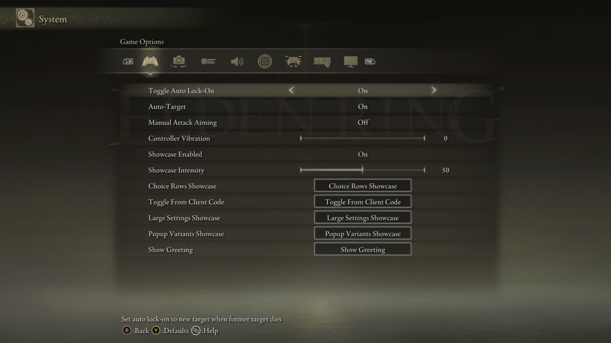</a> 
      Settings from multiple client mods, merged into Game Options.
    </td>
    <td width="50%" align="center">
       
      A localizable client message using Elden Ring's native dialog.
    </td>
  </tr>
  <tr>
    <td width="50%" align="center">
      <a href="docs/guides/controls/text-input.md">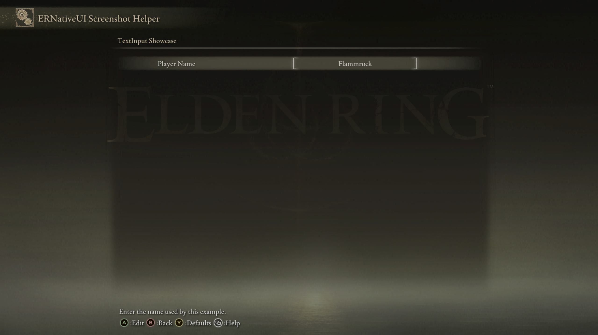</a> 
      Native text entry with placeholders, confirmed-value callbacks, and persisted values.
    </td>
    <td width="50%" align="center">
      <a href="docs/guides/controls/color-picker.md">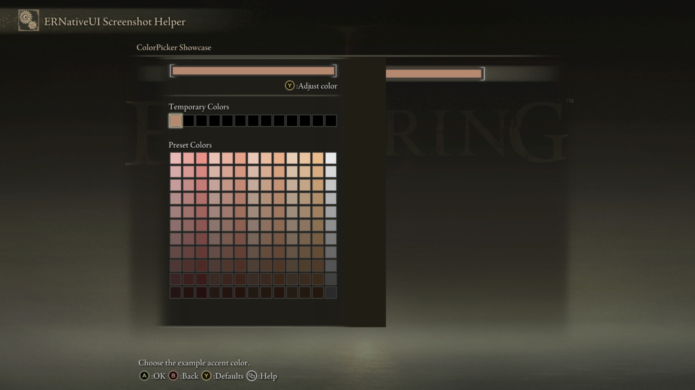</a> 
      Preset palettes and Elden Ring's custom RGB color editor.
    </td>
  </tr>
  <tr>
    <td width="50%" align="center">
      <a href="docs/guides/menus-and-pages.md">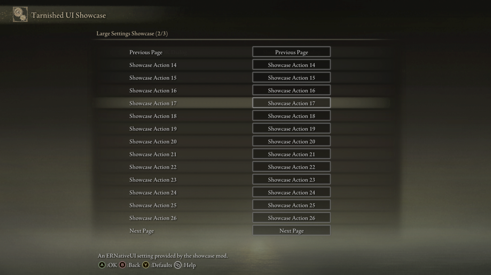</a> 
      Automatic pagination, native navigation, and per-page titles.
    </td>
    <td width="50%" align="center">
      <a href="docs/guides/controls/popup-choice.md">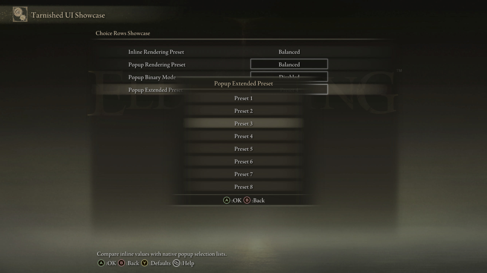</a> 
      Native selection lists for settings with several named choices.
    </td>
  </tr>
  <tr>
    <td width="50%" align="center">
      <a href="docs/guides/input-bindings.md">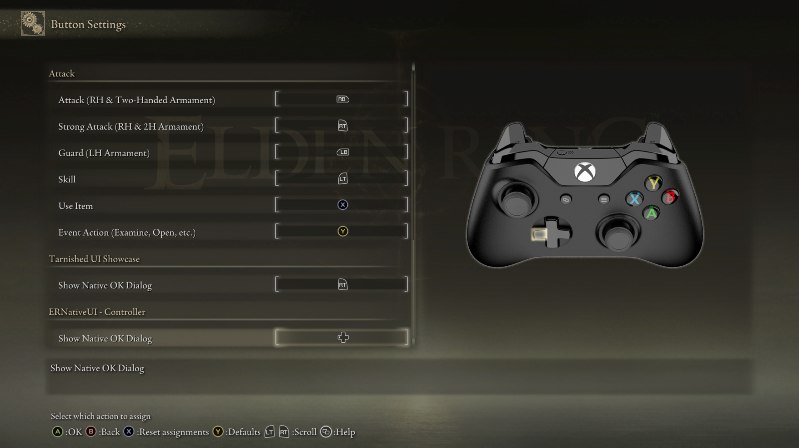</a> 
      Client-defined controller actions in Button Settings.
    </td>
    <td width="50%" align="center">
      <a href="docs/guides/input-bindings.md">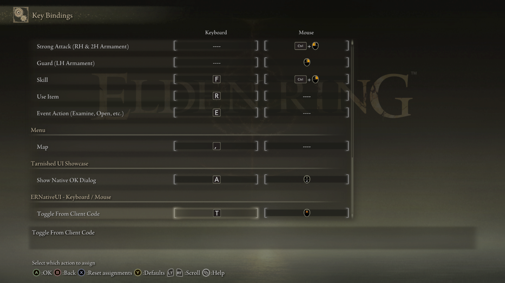</a> 
      Native keyboard and mouse assignment and remapping.
    </td>
  </tr>
  <tr>
    <td colspan="2" align="center">
      <a href="docs/guides/native-dialogs.md">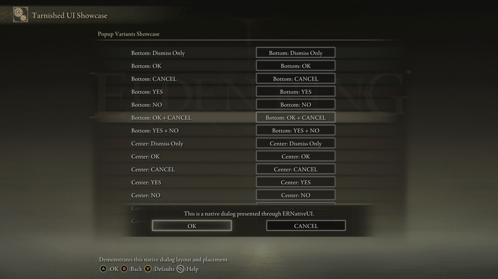</a> 
      Modal messages with configurable buttons and placement.
    </td>
  </tr>
</table>

  

## Supported controls

Every control below has a focused guide with a minimal example, complete
options, screenshots, and links to its native implementation research.

<table>
  <tr>
    <td width="50%" align="center">
      <a href="docs/guides/controls/button.md">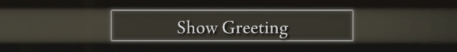</a> 
      <strong><a href="docs/guides/controls/button.md">Button</a></strong> 
      Trigger a client-mod action.
    </td>
    <td width="50%" align="center">
      <a href="docs/guides/controls/submenu.md">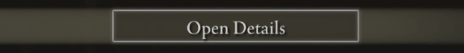</a> 
      <strong><a href="docs/guides/controls/submenu.md">Submenu</a></strong> 
      Organize settings in native child pages.
    </td>
  </tr>
  <tr>
    <td width="50%" align="center">
      <a href="docs/guides/controls/toggle.md">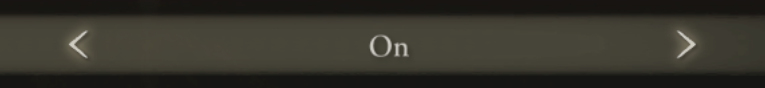</a> 
      <strong><a href="docs/guides/controls/toggle.md">Toggle</a></strong> 
      Expose a native on/off setting.
    </td>
    <td width="50%" align="center">
      <a href="docs/guides/controls/slider.md">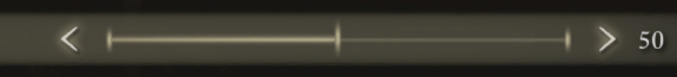</a> 
      <strong><a href="docs/guides/controls/slider.md">Slider</a></strong> 
      Adjust a bounded numeric value.
    </td>
  </tr>
  <tr>
    <td width="50%" align="center">
      <a href="docs/guides/controls/inline-choice.md">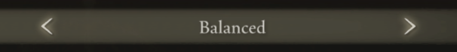</a> 
      <strong><a href="docs/guides/controls/inline-choice.md">Inline choice</a></strong> 
      Cycle through named options in place.
    </td>
    <td width="50%" align="center">
      <a href="docs/guides/controls/popup-choice.md">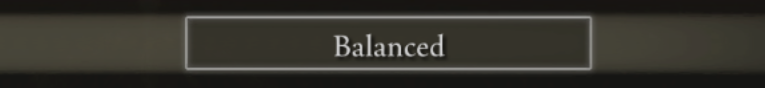</a> 
      <strong><a href="docs/guides/controls/popup-choice.md">Popup choice</a></strong> 
      Select an option from a native list.
    </td>
  </tr>
  <tr>
    <td width="50%" align="center">
      <a href="docs/guides/controls/text-input.md">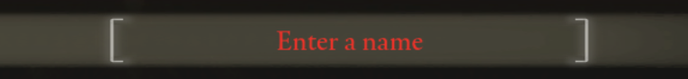</a> 
      <strong><a href="docs/guides/controls/text-input.md">TextInput</a></strong> 
      Edit text with a placeholder and configurable limit.
    </td>
    <td width="50%" align="center">
      <a href="docs/guides/controls/color-picker.md">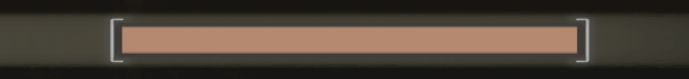</a> 
      <strong><a href="docs/guides/controls/color-picker.md">ColorPicker</a></strong> 
      Choose a color with native palette and RGB editors.
    </td>
  </tr>
</table>

## More than controls

- Add ordinary rows to supported built-in Configuration pages, including
  Game Options, Camera Options, Display, Sound, Network, Keyboard/Mouse, and
  Graphics. [Learn about menus and pages](docs/guides/menus-and-pages.md).
- Build nested submenus while ERNativeUI handles capacity, pagination, titles,
  Next, Previous, and the native Back stack.
- Queue native modal dialogs with configurable button combinations and bottom
  or centered placement. [Learn about dialogs](docs/guides/native-dialogs.md).
- Register controller, keyboard, and mouse actions that players can reassign
  in Elden Ring's binding screens. [Learn about input bindings](docs/guides/input-bindings.md).
- Follow the selected game language while preserving unknown Steam language
  identifiers for future locales. [Learn about localization](docs/guides/localization.md).
- Load, mutate, and explicitly save provider-owned configuration, or use the
  header-only input-assignment codec with another storage system.
  [Learn about storage](docs/guides/storage.md).
- Optionally install reproducible GFX presentation patches for expanded page
  capacity and enhanced TextInput and ColorPicker presentation.
  [Learn about GFX presentation](docs/guides/presentation-and-gfx.md).

The complete supported surface, minimum API versions, capabilities, and limits
live in the [feature matrix](docs/features.md).

  

## Get started

### Players

Download ERNativeUI from [Nexus Mods](https://www.nexusmods.com/eldenring/mods/10767)
or [GitHub Releases](https://github.com/Flammrock/ERNativeUI/releases/latest),
then follow the [player installation guide](docs/getting-started/player-installation.md).
Install one canonical host and load it before ordinary ERNativeUI client mods.

### Mod authors

The GitHub Windows package contains the host, public headers, CMake package,
examples, tools, and documentation. Client mods need only `erui.h`, or
`erui.h` plus `ERNativeUI.hpp`; they do not link an ERNativeUI import library.

1. [Install the SDK](docs/getting-started/setup.md).
2. [Build “Hello, Tarnished!”](docs/getting-started/first-mod.md).
3. Continue from the [commented template](examples/template/README.md) or
   browse the [buildable examples](examples/README.md).

MSVC, clang-cl, and MinGW-w64 client mods can use the same stable host ABI.

## Compatibility at a glance

- Windows x64, offline play, and Easy Anti-Cheat disabled are required.
- Mod Engine 2 is the primary supported loader.
- Load exactly one `ERNativeUI.dll` for all client mods.
- Use a release that names the installed Elden Ring executable after every
  game update.
- Solid Uncapper coexistence has a documented load order and tested matrix.
- Seamless Co-op 2.0.1 was live-tested with the Elden Ring 2.7.0.0 reference
  executable, with no incompatibility observed for that exact combination.
- Shadow of the Erdtree remains explicitly unverified until its live matrix
  is completed.
- Host and committed client DLLs must remain loaded until process exit.

See [Game and mod compatibility](docs/compatibility.md) for exact tested
versions, optional GFX conflicts, Solid Uncapper setup, and useful bug reports.

  

## Documentation

| I want to... | Start here |
|---|---|
| Install ERNativeUI as a player | [Player installation](docs/getting-started/player-installation.md) |
| Create my first client mod | [Getting started](docs/getting-started/README.md) |
| Add menus, controls, dialogs, bindings, or localization | [Mod-author guides](docs/guides/README.md) |
| Check supported features and exact API contracts | [Feature matrix](docs/features.md) · [API reference](docs/reference/README.md) |
| Understand the host/client architecture | [How ERNativeUI works](docs/how-it-works.md) |
| Reproduce the native UI research | [Research library](docs/research/README.md) |
| Build, test, contribute, or publish | [Contributing](docs/contributing/README.md) · [Release guide](docs/contributing/releasing.md) |

The [documentation home](docs/README.md) provides the complete reader-oriented
index.

## Versioning

ERNativeUI release versions and ERUI public API versions are independent.
Within a compatible `1.x` host line, earlier published `1.x` APIs remain
available, so a client built with API 1.0 continues to work with a compatible
newer 1.x host. A future host major may drop earlier-major APIs unless its
release explicitly preserves them.

Read [Versioning](docs/versioning.md), the
[changelog](CHANGELOG.md), and the [API migration guides](docs/migrations/README.md)
before declaring a client dependency.

  

## License and contributions

ERNativeUI is my first mod. It is released under the
[MIT License](LICENSE.txt): you may use, modify, redistribute, fork, or improve
it while preserving the license terms and copyright notice.

Bug reports, compatibility updates, documentation improvements, examples, and
carefully validated native-interface research are welcome. Read the
[contribution guide](docs/contributing/README.md) or open a
[GitHub issue](https://github.com/Flammrock/ERNativeUI/issues).
