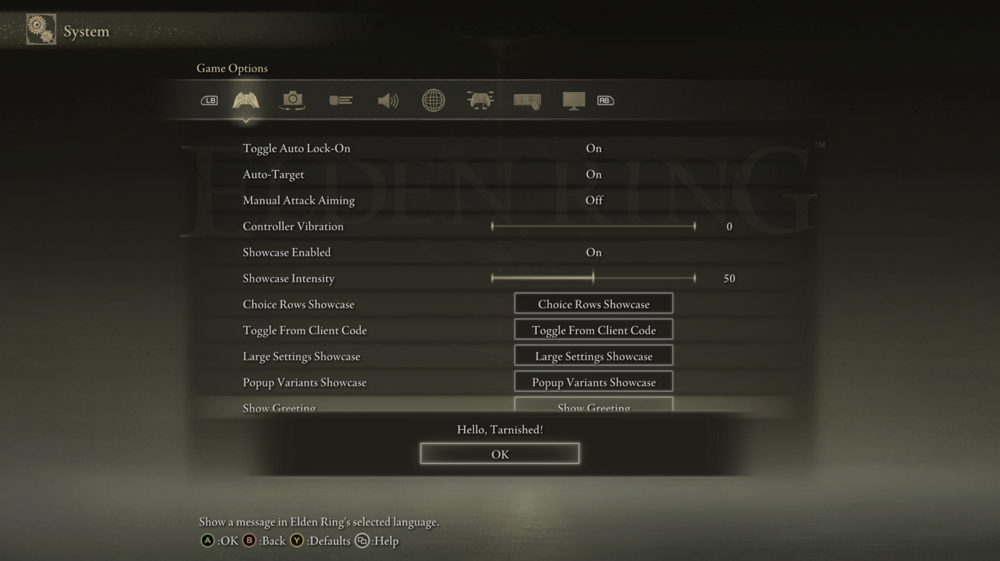

# ERNativeUI


ERNativeUI is a process-wide native menu host for Elden Ring mods. One
`ERNativeUI.dll` owns the game hooks and combines settings registered by any
number of client mods into Elden Ring's real **System -> Game Options** UI.
It uses native controls, focus, help text, controller/mouse navigation,
subpages, and the native Back stack--not an ImGui or DirectX overlay.

ERNativeUI is my first mod. It is released under the MIT License;
contributions, forks, and improvements are welcome as long as the license
terms and copyright notice are preserved.

> ERNativeUI is for offline use with Easy Anti-Cheat disabled. Native addresses
> are game-version-sensitive. Hot unloading the host or a registered client is
> not supported.

### Solid Uncapper compatibility

ERNativeUI can coexist with Solid Uncapper's native in-game menu. List
`Solid Uncapper.dll` before `ERNativeUI.dll` in Mod Engine 2's `external_dlls`.
ERNativeUI captures the shared native interfaces early, waits for Solid
Uncapper's asynchronous menu initialization, validates its three detours, and
then installs a cooperative hook chain. DLL list order alone is insufficient
because both mods finish initialization on worker threads.

## What it provides

- One canonical runtime, regardless of how many mods register settings.
- Native toggles, byte sliders, inline choices, popup-list choices, buttons,
  nested submenus, labels, and help text.
- Automatic global root pagination and per-submenu pagination.
- Automatic per-slice page titles, with an optional provider formatter.
- Native Previous/Next navigation, including Elden Ring's real page-pop path.
- FIFO native modal alerts with selectable buttons and bottom/center placement.
- Host-owned toggle/slider/choice storage with callback notification and
  get/set APIs.
- Deterministic provider order: priority, provider ID, then insertion order.
- A strict C11-compatible ABI in `erui.h`.
- A friendly, header-only C++17 client API in `ERNativeUI.hpp`.
- Runtime game-language discovery with a known-language enum and Steam's exact
  identifier for forward-compatible localization.
- No client import library, static library, shared STL objects, or allocator
  ownership across the DLL boundary.

## Showcase

<table>
  <tr>
    <td width="50%" align="center">
      <br>
      <sub>Native controls from multiple client mods integrated into Game Options.</sub>
    </td>
    <td width="50%" align="center">
      <br>
      <sub>A localized message using Elden Ring's native dialog presentation.</sub>
    </td>
  </tr>
  <tr>
    <td width="50%" align="center">
      <br>
      <sub>Automatic pagination, native navigation, and per-page titles.</sub>
    </td>
    <td width="50%" align="center">
      <br>
      <sub>Inline choices and native popup selection lists.</sub>
    </td>
  </tr>
  <tr>
    <td colspan="2" align="center">
      <br>
      <sub>Native modal variants with configurable buttons and placement.</sub>
    </td>
  </tr>
</table>

## Architecture

```text
Client DLLs built with              One shared host                    Elden Ring
the header-only SDK                 ---------------                    ----------
----------------------              ERNativeUI.dll
ModClient1.dll --+                  -> provider registry
ModClient2.dll --+-- stable C ABI --> merged menu model
ModClient3.dll --+                  -> global pagination
                                     -> native rows, text and values
                                     -> one set of hooks -------------> Game Options UI
                                               |
                                               +-- invokes client callbacks
```

Client mods own their gameplay logic and callbacks. They never install menu
hooks or create pagination rows: each mod declares logical content through the
header-only API, and the single host copies it, combines every provider, and
materializes the resulting native UI.

Detailed design and maintenance material:

- [Public API](docs/API.md)
- [ABI stability contract](docs/ABI_STABILITY.md)
- [Architecture and lifecycle](docs/ARCHITECTURE.md)
- [Native addresses and pagination research](docs/NATIVE_ADDRESSES_AND_PAGINATION.md)
- [Native dialogs and modal input research](docs/NATIVE_DIALOGS.md)
- [Native popup-choice research](docs/NATIVE_POPUP_CHOICES.md)
- [Mod compatibility](docs/COMPATIBILITY.md)
- [Release and versioning guide](docs/RELEASING.md)
- [Page titles and presentation](docs/PAGE_PRESENTATION.md)
- [GFX patcher](docs/GFX_PATCHER.md)
- [Validation checklist](VALIDATION.md)

## Player installation

Place the host and desired client mods where Mod Engine 2 can load them, with
the host listed first:

```toml
[modengine]
external_dlls = [
    "mod\\ERNativeUI\\ERNativeUI.dll",
    "mod\\ERNativeUI\\examples\\TarnishedUIShowcase.dll",
    "mod\\MyMod\\MyMod.dll"
]
```

`ERNativeUI.ini` is created beside `ERNativeUI.dll` from an embedded default
when missing. Existing files are never overwritten. Do not load the template
DLL in a normal setup; it is a source starting point for developers.

Client mods discover the already-loaded host dynamically. They do not call
`LoadLibrary`, and a missing host disables only their optional configuration
menu instead of preventing the client DLL from loading.

Only one canonical `ERNativeUI.dll` should be installed. Individual client
mods should declare it as a dependency rather than bundle private copies.

## Mod-author quick start

Requires Windows x64 and C++17 or newer:

```cpp
#include <ernativeui/ERNativeUI.hpp>

HMODULE module;

void apply() noexcept
{
    // Keep UI-thread callbacks short.
}

void ERUI_CALL enabled_changed(void*, std::uint8_t value) noexcept
{
    // Copy value into your mod state and persist it if desired.
}

DWORD WINAPI initialize(void*) noexcept
{
    erui::ProviderOptions options{};
    options.provider_id = "com.example.my-mod";
    options.display_name = L"My Mod";
    options.owner_module = module;

    const auto result = erui::register_menu(options, [](erui::Menu& menu) {
        auto root = menu.root();
        root.add_toggle(
            L"Enabled",
            L"Enable or disable My Mod.",
            1,
            &enabled_changed);
        root.add_button<&apply>(
            L"Apply",
            L"Apply the current settings.");

        auto advanced = root.add_submenu(
            L"Advanced",
            L"Open advanced settings.");
        advanced.set_presentation(L"My Mod - Advanced", L"Advanced Settings");
        advanced.add_button<&apply>(L"Apply Advanced", L"Apply these values.");
    });

    if (!result) {
        OutputDebugStringW(result.error().message().c_str());
    }
    return 0;
}
```

Start registration from a worker after `DllMain` returns. A complete,
extensively commented starting project is in [examples/template](examples/template).
The buildable [Tarnished UI Showcase](examples/tarnished_ui_showcase) exercises
host-owned values, callbacks, both native choice presentations, submenus, and
33-row pagination, translated for every language currently reported by Elden
Ring. The smaller [Localized Greeting](examples/localized_greeting) demonstrates
the recommended localization and fallback pattern.

## Localization

ERNativeUI asks the Steamworks API used by Elden Ring for the active game
language. It does not inspect the Windows locale, parse Steam configuration
files, hook Steam functions, or depend on a game RVA.

Call `erui::query_game_language()` before registration when the provider name
must be translated. `Menu::game_language()` and
`Registration::game_language()` expose the same owned snapshot later. Each
`LanguageInfo` contains a convenient `GameLanguage` classification plus the
exact Steam identifier. For example, Korean is `koreana`, Brazilian Portuguese
is `brazilian`, and Latin American Spanish is `latam`.

Use English when discovery is unavailable. If `known` is `unknown` but
`identifier` is non-empty, a mod can recognize a newer or community locale
without waiting for an ERNativeUI update.

ERNativeUI's own navigation strings are loaded from UTF-8
`locales/<identifier>.ini` beside the host DLL. Missing files and keys fall
back independently to English embedded in the DLL. Shipped files cover every
currently reported non-English Elden Ring locale; translators can edit or add
files without rebuilding the host. See the
[locale format](assets/locales/README.md).

Choice rows use an option index as their value and accept between 1 and 32
non-empty UTF-16 labels. The host copies the option array and its strings
synchronously:

```cpp
const std::wstring_view presets[] = {
    L"Minimal", L"Balanced", L"Maximum"
};
erui::ChoiceOptions preset{};
preset.values = presets;
preset.count = std::size(presets);
preset.initial_index = 1;
root.add_inline_choice(
    L"Inline Rendering Preset",
    L"Change a named preset with left/right input.",
    preset,
    &preset_changed);

root.add_popup_choice(
    L"Popup Rendering Preset",
    L"Open Elden Ring's native selection list.",
    preset,
    &popup_preset_changed);
```

`add_inline_choice` changes in place with left/right input;
`add_popup_choice` renders as an action row and opens a native list. Their
callbacks and `Registration::get_value`/`set_value` all use the same
zero-based selected index. Choice rows are always interactive because the
corresponding native constructors have no proven disabled-state parameter.

### CMake client integration

When ERNativeUI is included as a subdirectory:

```cmake
target_link_libraries(MyMod PRIVATE ERNativeUI::SDK)
target_compile_features(MyMod PRIVATE cxx_std_17)
```

`ERNativeUI::SDK` is an `INTERFACE` target: it adds headers and the C++17
requirement only. Despite the word `target_link_libraries`, no ERNativeUI
binary is linked into the client. Strict-C clients use `ERNativeUI::CABI`.

Against an installed SDK:

```cmake
find_package(ERNativeUI 0.9 CONFIG REQUIRED)
target_link_libraries(MyMod PRIVATE ERNativeUI::SDK)
```

You may also add `include/` directly to the include path. There is no required
`ERNativeUI.lib` or MinGW `.dll.a`.

## C ABI and compiler compatibility

The host exports exactly one public symbol, `ERUI_GetApi`, which accepts the
supported exact API version and fills the corresponding function table.

The DLL boundary contains only fixed-width integers, explicitly sized POD
descriptors, UTF-8/UTF-16 pointer-and-length views, opaque 64-bit handles, and
plain `__cdecl` function pointers. Input strings are copied synchronously.
STL types, C++ exceptions and cross-module allocation ownership never cross
the boundary.

This permits, for example, an MSVC C++20 host and a MinGW C++17 client. The
normal suite compiles `erui.h` as C11 and the wrapper as C++17; the documented
release validation also runs strict MinGW C11/C++17 smoke commands.

The host itself must use an MSVC-compatible ABI (MSVC or clang-cl) because one
private Elden Ring action-row interface directly consumes an MSVC
`std::function`. No such compiler-owned object crosses the public client ABI.

## Registration lifecycle

The v1 host exposes its API during a bounded startup registration phase.
Providers build private drafts and publish them with one atomic commit. The
host waits until provider activity is quiet and no draft is active for
`RegistrationQuietMs`, bounded by `RegistrationMaxWaitMs`, then freezes the
merged registry and installs one immutable native runtime.

`commit_provider` waits for that final installation. A successful wrapper
result means the native runtime is ready; a broken game signature reports
`ERUI_HOST_FAILED`. Do registration from a worker, never from `DllMain`.

This deliberately avoids replacing page objects while Elden Ring is using
them. A client arriving after the startup phase receives
`ERUI_REGISTRATION_CLOSED` and logs a clean error. The defaults are 750 ms of
quiet time and a 5-second absolute startup window.

Committed provider DLLs are pinned until process exit because the host retains
callback addresses. Buttons run synchronously on Elden Ring's UI thread;
toggle, slider, and choice notifications run on the host polling worker. No
callback may throw through the C ABI.

## Native modal alerts

`Registration::alert()` queues an Elden Ring message with native localized
buttons. `AlertOptions` selects `ok`, `cancel`, `yes`, `no`, `ok_cancel`,
`yes_no`, or `dismiss_only`, and places the presentation at `bottom` or
`center`. The C++ defaults are an OK button at the bottom, so the short
convenience overload remains useful for ordinary notices.

```cpp
void ERUI_CALL alert_closed(
    void*, ERUI_Result result, erui::AlertResponse response) noexcept {
    if (result == ERUI_OK && response == erui::AlertResponse::primary) {
        // The player selected YES.
    }
}

erui::AlertOptions options{};
options.buttons = erui::AlertButtons::yes_no;
options.placement = erui::AlertPlacement::center;

registration.alert(
    L"Apply the recommended settings?", options, &alert_closed);
```

For one-button layouts, every successful close, including Back, reports
`primary`. For two-button layouts, the left button reports `primary`; the
right button and Back report `secondary`. A successful no-button alert reports
`dismissed`. `none` accompanies an operational failure or a completion for
which no trustworthy native response payload was available; inspect the
`ERUI_Result` first.

Requests from every provider share one bounded FIFO; completion callbacks are
dispatched asynchronously by the host worker. While an ERNativeUI alert is
visible, matching Game Options pages cannot move or activate a row, and the
page's native Back action is suppressed. Back is still delivered to the popup
when it is a valid alert response. Normal page input resumes after dismissal.
This also covers alerts queued programmatically rather than from a particular
button callback.

The alert path uses a game-owned blocking-task slot and refuses to replace an
existing Elden Ring dialog. If any required game-version-sensitive signature
is unavailable, alert calls return `ERUI_NOT_SUPPORTED` while registered menu
rows continue to work. See
[Native dialogs and modal input research](docs/NATIVE_DIALOGS.md) for the
ownership model, recovered ABI, and maintenance evidence.

## Pagination

Subpages have a conservative capacity of 15 native rows:

```text
first overflow slice:  14 content + Next
middle slice:          Previous + 13 content + Next
final slice:           Previous + up to 14 content
```

The existing Controller Settings page contains four vanilla rows. A vanilla
six-row GFX leaves two custom slots; the optional 13-row patched GFX leaves
nine. The host reads the live page capacity and reserves one custom slot for
Next when necessary.

Every continuation is a real native child page. Previous invokes the validated
native Back wrapper, so Elden Ring restores the actual parent stack state.

Paginated submenu titles default to `Title (n/t)`. The existing shared
Controller Settings page keeps Elden Ring's outer `Configuration` heading;
shared-root continuations use `ERNativeUI`, while provider-owned submenus may
override their outer title. Modders can also supply a bounded startup-time
formatter for per-slice titles. See
[Page titles and presentation](docs/PAGE_PRESENTATION.md) for the API,
lifetime rules, and the native GFX research behind this behavior.

## Optional Controller GFX patch

ERNativeUI includes an optional 13-row `02_040_optionsetting.gfx` for a more
spacious Controller Settings page. The DLL also supports Elden Ring's native
six-row asset without modification and reads capacities 6 through 13 from the
live page object. `ERNativeUIGfxPatcher.exe` can reproduce any supported layout
from your own UXM-extracted asset. See
[GFX patcher guide](docs/GFX_PATCHER.md).

## Build, test and deploy

Requirements:

- CMake 3.28 or newer
- Visual Studio 2022 or newer with x64 C++ tools
- Git

```bat
build.bat
```

`build.bat` configures, builds, and tests in one step. The equivalent individual
commands used by CI are shown below.

### Build

```bat
cmake --preset windows-release
cmake --build --preset windows-release
```

### Test

```bat
ctest --preset windows-release
```

All 17 native-model, ABI, wrapper, pagination, dialog, choice, and GFX tests
must pass before deployment.

### Deploy for local testing

Every successful build stages Mod Engine 2-ready files under:

```text
build/preset-release/deploy/Release/
+-- ERNativeUI.dll
+-- ERNativeUI.ini
+-- README.md, VALIDATION.md
+-- LICENSE.txt, THIRD_PARTY_NOTICES.txt
+-- docs/
|   +-- API.md
|   +-- GFX_PATCHER.md
|   `-- native and architecture documentation
+-- licenses/
`-- examples/
    +-- TarnishedUIShowcase.dll
    `-- MyERNativeUIMod.dll
```

Copy the required DLLs and loose `menu` directory from this staging tree into
your Mod Engine 2 mod directory, then list the host and desired client DLLs in
your Mod Engine 2 configuration.

Create a conventional install tree for SDK or relocation testing with:

```bat
cmake --install build/preset-release --config Release --prefix dist/ERNativeUI
```

### Package a release locally

Create the same Windows archive published on GitHub with:

```powershell
./tools/package_release.ps1 `
  -BuildDirectory build/preset-release `
  -Version 0.9.0
```

When preparing a Nexus upload, explicitly request the additional flattened,
Mod Engine 2-ready archive:

```powershell
./tools/package_release.ps1 `
  -BuildDirectory build/preset-release `
  -Version 0.9.0 `
  -IncludeNexus
```

Both commands write under `dist/release/`. GitHub Actions intentionally runs
the first form and uploads only `ERNativeUI-X.Y.Z-windows-x64.zip`.

The generated host import library is a build by-product and is not installed
or required by clients.

Useful options:

```text
ERNATIVEUI_BUILD_HOST
ERNATIVEUI_BUILD_EXAMPLES
ERNATIVEUI_BUILD_GFX_PATCHER
ERNATIVEUI_BUILD_TESTS
ERNATIVEUI_DEPLOY_DIR
BUILD_TESTING
```

## Runtime configuration

```ini
[Logging]
# Disabled by default. Set to 1 temporarily when troubleshooting.
EnableLog = 0

[Runtime]
RegistrationQuietMs = 750
RegistrationMaxWaitMs = 5000
InjectionCooldownMs = 250

[Diagnostics]
EnableDiagnostics = 0
```

When `EnableLog = 1`, logs are written to `ERNativeUI.log` beside the host DLL.
With the default value `0`, the host does not create, truncate, append to, or
flush a log file. An old log is left untouched. Diagnostics add address
resolution, registry, pagination, native row and callback traces and are useful
only while logging is enabled.

## Current limitations

- Windows x64 only.
- The host requires an MSVC-compatible compiler ABI; clients may use MinGW.
- Offline/EAC-disabled use only.
- Host and registered providers cannot hot-unload.
- Provider topology is immutable after the bounded startup phase in ABI v1.
- Native signatures must be updated when a game update changes the relevant
  machine code.
- Client exceptions must not cross callbacks; use `noexcept` functions.
- A custom top-level Game Options tab remains outside the production backend.

## License and contributions

ERNativeUI is licensed under the [MIT License](LICENSE.txt). You may use,
modify, redistribute, fork, or enhance it--including for other mods--provided
the MIT license terms and copyright notice are retained.

Bug reports, compatibility updates, documentation improvements, examples and
carefully reviewed native-interface research are welcome.

GitHub releases are managed by Release Please from Conventional Commits. Each
release contains one full Windows SDK/runtime archive. Nexus packaging remains
an explicit local maintainer operation. Maintainers should follow
[the release guide](docs/RELEASING.md).
