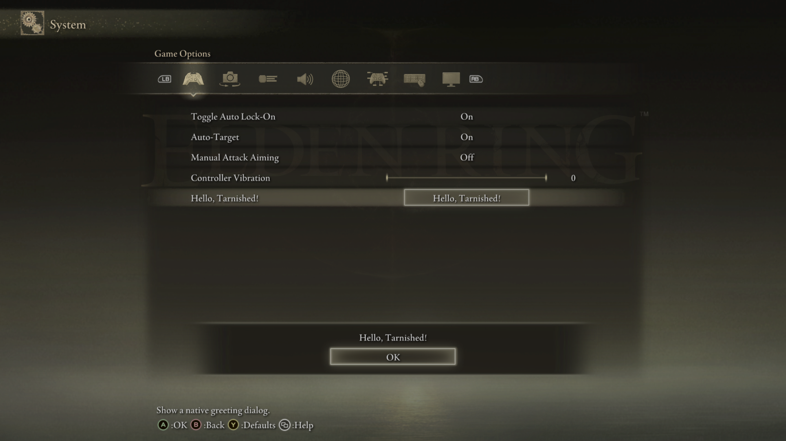

# Hello, Tarnished! with CMake

This walkthrough starts with an empty directory and produces a Windows x64
client DLL. When its row is activated in Elden Ring, it opens a native dialog
saying **Hello, Tarnished!**

Complete [Install the SDK](setup.md) first. The commands below assume the
ERNativeUI 1.1.0 SDK was extracted to:

```text
C:\SDK\ERNativeUI-1.1.0-windows-x64
```

Replace that path when you installed another compatible release or location.

## 1. Create the project

Create this directory tree anywhere outside the ERNativeUI SDK:

```text
HelloTarnished\
|-- CMakeLists.txt
`-- src\
    `-- hello_tarnished.cpp
```

Put this in `CMakeLists.txt`:

```cmake
cmake_minimum_required(VERSION 3.24)
project(HelloTarnished LANGUAGES CXX)

# This is a minimum ERNativeUI package-release requirement. It is not the
# runtime API selector; the API 1.1 wrapper performs that check at runtime.
find_package(ERNativeUI 1.1.0 CONFIG REQUIRED)

add_library(HelloTarnished MODULE src/hello_tarnished.cpp)
target_link_libraries(HelloTarnished PRIVATE ERNativeUI::SDK)
target_compile_features(HelloTarnished PRIVATE cxx_std_17)
target_compile_definitions(HelloTarnished PRIVATE WIN32_LEAN_AND_MEAN NOMINMAX)
set_target_properties(HelloTarnished PROPERTIES PREFIX "")

if(MSVC)
    target_compile_options(HelloTarnished PRIVATE /W4 /permissive- /utf-8)
endif()
```

`ERNativeUI::SDK` is header-only. This command does not link an import library
and does not embed `ERNativeUI.dll` into the client.

## 2. Add the client source

Put this in `src/hello_tarnished.cpp`:

```cpp
#include <ernativeui/ERNativeUI.hpp>

#include <Windows.h>

#include <atomic>

namespace {

HMODULE g_module{};
erui::Registration g_registration{};
std::atomic_bool g_registration_ready{false};

void show_greeting() noexcept {
    // The menu can only be used after initialize_mod publishes the successful
    // registration to Elden Ring's UI thread.
    if (g_registration_ready.load(std::memory_order_acquire)) {
        (void)g_registration.alert(L"Hello, Tarnished!");
    }
}

DWORD WINAPI initialize_mod(void*) noexcept {
    // connect() discovers the host already loaded by Mod Engine 2 and asks it
    // for the API 1.1 function table. It does not load ERNativeUI.dll itself.
    const auto connection = erui::connect();
    if (!connection) {
        OutputDebugStringW(L"[HelloTarnished] ERNativeUI connection failed.\n");
        return 1;
    }

    erui::ProviderOptions options{};
    options.provider_id = "hello-tarnished";
    options.display_name = L"Hello, Tarnished!";
    options.owner_module = g_module;

    const auto registration = connection.value().register_menu(
        options,
        [](erui::Menu& menu) {
            menu.root().add_button<&show_greeting>(
                L"Hello, Tarnished!",
                L"Show a native greeting dialog.");
        });

    if (!registration) {
        OutputDebugStringW(L"[HelloTarnished] Menu registration failed.\n");
        return 1;
    }

    g_registration = registration.value();
    g_registration_ready.store(true, std::memory_order_release);
    return 0;
}

} // namespace

BOOL APIENTRY DllMain(HMODULE module, DWORD reason, LPVOID) {
    if (reason == DLL_PROCESS_ATTACH) {
        g_module = module;
        DisableThreadLibraryCalls(module);

        // Windows holds the loader lock while DllMain runs. Discovery and
        // registration must happen later on a worker thread.
        if (HANDLE thread = CreateThread(
                nullptr, 0, &initialize_mod, nullptr, 0, nullptr)) {
            CloseHandle(thread);
        }
    }
    return TRUE;
}
```

`g_registration_ready` is only a safe hand-off flag. Initialization and menu
callbacks can run on different threads, so the callback checks the flag before
using the newly returned registration. You can keep this small pattern as-is
in a first mod.

Before publishing a real mod, replace `hello-tarnished` with a stable ID for
your mod. It may contain 1..255 ASCII letters, digits, `.`, `_`, or `-`; it is
case-sensitive and must be distinct among the providers loaded in the process.
Do not localize or change it between ordinary releases.

## 3. Configure CMake

Open **Developer Command Prompt for VS 2022**, change to the
`HelloTarnished` directory, and run:

```bat
cmake -S . -B build -A x64 -DCMAKE_PREFIX_PATH="C:\SDK\ERNativeUI-1.1.0-windows-x64"
```

What each argument means:

- `-S .` uses the current directory as the source project.
- `-B build` writes generated files to a new `build` directory.
- `-A x64` prevents an accidental 32-bit DLL.
- `CMAKE_PREFIX_PATH` tells `find_package` which extracted SDK root contains
  `lib\cmake\ERNativeUI\ERNativeUIConfig.cmake`.

If configuration says ERNativeUI was not found, verify that the path directly
contains `bin`, `include`, `lib`, and `share`. Alternatively pass
`-DERNativeUI_DIR="...\lib\cmake\ERNativeUI"` as explained in the
[SDK setup guide](setup.md#option-a-let-cmake-find-the-extracted-sdk).

## 4. Build the client DLL

Run:

```bat
cmake --build build --config Release
```

The result is normally:

```text
HelloTarnished\build\Release\HelloTarnished.dll
```

If your generator uses a different output layout, the final build lines print
the complete output path. Confirm the DLL is x64 before loading it into Elden
Ring.

## 5. Deploy the host and client

Create this layout inside the Mod Engine 2 directory:

```text
<mod-engine-2>\
|-- config_eldenring.toml
`-- mod\
    |-- ERNativeUI\
    |   |-- ERNativeUI.dll
    |   |-- ERNativeUI.ini
    |   |-- locales\
    |   `-- menu\
    `-- HelloTarnished\
        `-- HelloTarnished.dll
```

Copy `ERNativeUI.dll`, `ERNativeUI.ini`, `locales`, and `menu` from the
extracted SDK's `bin` directory. Copy the DLL you just built into the
`HelloTarnished` directory.

`ERNativeUI.ini` is optional because the host generates a default file when it
is missing. The `locales` directory provides host translations. The `menu`
directory contains optional patched GFX presentation used by enhanced widgets
and expanded page capacity.

In `config_eldenring.toml`, load the shared host before the client:

```toml
[modengine]
external_dlls = [
    "mod\\ERNativeUI\\ERNativeUI.dll",
    "mod\\HelloTarnished\\HelloTarnished.dll",
]
```

To load the optional loose GFX files, add ERNativeUI to the existing mod-loader
list:

```toml
[extension.mod_loader]
enabled = true
mods = [
    { enabled = true, name = "ERNativeUI", path = "mod\\ERNativeUI" },
]
```

Preserve any DLL and mod entries already present in your own configuration.
Only one `ERNativeUI.dll` should be loaded into the process.

## 6. Run the test

1. Launch Elden Ring through Mod Engine 2 with Easy Anti-Cheat disabled.
2. Open **System -> Game Options**.
3. Find the **Hello, Tarnished!** row.
4. Activate it and confirm that the native **Hello, Tarnished!** dialog opens.
5. Dismiss the dialog, leave the menu, and confirm the game remains responsive.



*The finished client contributes one Game Options row and opens an
ERNativeUI-owned native greeting.*

If the row is absent, see [Common client-mod errors](common-errors.md). Logging
is disabled by default; temporarily set `EnableLog = 1` in `ERNativeUI.ini`
when diagnostics are needed.

## What to learn next

This small DLL demonstrates the complete lifecycle:

```text
Mod Engine 2 loads the host -> Mod Engine 2 loads the client
-> client worker connects -> client registers one row
-> player activates the row -> client asks the host for a native dialog
```

Continue from the commented
[client-mod template](../../examples/template/README.md), or choose a feature
from the [mod-author guide index](../guides/README.md).

Return to the [getting-started index](README.md).
