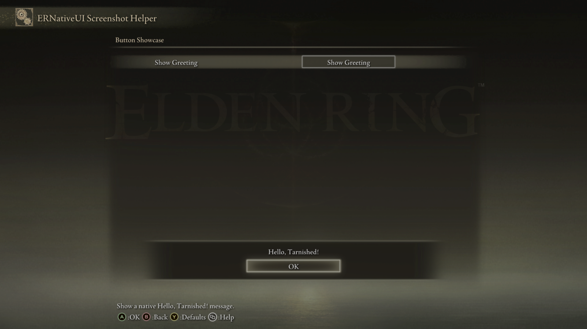

# Button

A `Button` adds an action row to an `erui::Page`. When the player presses
Elden Ring's Confirm control, ERNativeUI calls the function attached to that
row. Unlike a Toggle or Slider, a Button does not store a value.


*The left text is the row label. The framed text on the right is the native
action control that the player confirms.*

## Minimal example

This example adds one Button that opens a native greeting:

```cpp
#include <ernativeui/ERNativeUI.hpp>

erui::Registration g_registration{};

void show_greeting() noexcept
{
    g_registration.alert(L"Hello, Tarnished!");
}

erui::RowHandle add_greeting_button(erui::Page page) noexcept
{
    return page.add_button<&show_greeting>(
        L"Show Greeting",
        L"Show a native Hello, Tarnished! message.");
}
```

Call `add_greeting_button(page)` from the menu-builder body. Its argument is
the `erui::Page` on which the row should appear; choosing that argument chooses
the Button's location. The [first-mod guide](../../getting-started/first-mod.md)
shows where the builder receives or creates pages. This guide starts with a
`Page` so unrelated connection and menu setup does not hide the Button call.

The return type is `erui::RowHandle`. A Button currently has no operation that
requires this handle after registration, so a mod may discard it when it does
not need to identify the row.

When the player confirms the row, its callback requests this native alert:



*The Button invokes `show_greeting()`, which queues the alert.*

## API at a glance

In schematic form, the convenient overload is:

```cpp
const erui::RowHandle button =
    page.add_button<&callback>(label, help_message);
```

Here, `page` is an `erui::Page`, `callback` names a `void() noexcept`
function, and `label` and `help_message` are UTF-16 strings. The call returns
an `erui::RowHandle`.

Its full shape is:

```cpp
template <void (*Callback)() noexcept>
erui::RowHandle erui::Page::add_button(
    std::wstring_view label,
    std::wstring_view help_message,
    bool enabled = true) noexcept;
```

The callback for this overload must have exactly this shape:

```cpp
void callback() noexcept;
```

## Performing a long task

A Button callback runs synchronously on Elden Ring's UI thread. A short,
UI-thread-safe client-state change, such as setting an atomic request flag, is
fine there, but blocking or substantial work must run elsewhere.

This example uses the Windows thread pool. `start_long_task()` returns to the
game immediately, while `run_long_task_on_worker()` performs the work on a
worker thread. It reuses the `g_registration` handle from the minimal example
to queue progress alerts:

```cpp
#include <ernativeui/ERNativeUI.hpp>

#include <Windows.h>

#include <atomic>

std::atomic_bool g_long_task_running{false};

void long_task() noexcept
{
    // Perform long, thread-safe work here. Do not touch game objects that are
    // restricted to Elden Ring's game or UI thread.
}

DWORD WINAPI run_long_task_on_worker(void*) noexcept
{
    g_registration.alert(L"The long task is running.");
    long_task();
    g_long_task_running.store(false, std::memory_order_release);
    g_registration.alert(L"The long task is finished.");
    return 0;
}

void start_long_task() noexcept
{
    if (g_long_task_running.exchange(true, std::memory_order_acq_rel)) {
        g_registration.alert(
            L"A long task is already running. Please try again later.");
        return;
    }

    if (!QueueUserWorkItem(
            &run_long_task_on_worker,
            nullptr,
            WT_EXECUTELONGFUNCTION)) {
        g_long_task_running.store(false, std::memory_order_release);
        g_registration.alert(L"The long task could not be started.");
    }
}

erui::RowHandle add_long_task_button(erui::Page page) noexcept
{
    return page.add_button<&start_long_task>(
        L"Run Long Task",
        L"Run this mod's long task.");
}
```

Call `add_long_task_button(page)` from the builder with the destination
`erui::Page`, just like the minimal example.

`long_task()` is the deliberately replaceable part: its body represents the
slow operation owned by the client mod.

`QueueUserWorkItem` is a Windows API, not an ERNativeUI function. A mod that
already owns a worker or task queue can submit the same request to that system
instead. Use a dedicated worker for frequent or indefinitely blocking work.
Work that changes thread-restricted game state must later be handed to the
correct game-side thread by the client mod.

The worker queues a **running** alert before beginning the slow operation and a
**finished** alert after it returns. If the player presses the Button again
before completion, `start_long_task()` queues an **already running** alert
instead of starting another copy. If Windows rejects the work item, the flag
is reset and the player sees a failure alert. Alert requests are queued; see
[Native dialogs](../native-dialogs.md) for their complete options and callback
behavior.

## Parameters

| Parameter | Meaning | Default or rule |
|---|---|---|
| `&callback` | Function attached to the Button as the template argument | Required; exact signature is `void callback() noexcept` |
| `label` | Text shown on the row | Required, non-empty UTF-16; copied during the call |
| `help_message` | Contextual help shown by Elden Ring | May be empty; copied during the call |
| [`enabled`](options/enabled.md) | Whether to include the Button when the menu is built | Defaults to `true`; `false` omits the row completely |

Button has no separate options object.

## Availability

[Availability and capabilities](../availability.md) explains how to read this
table and check a capability in client code.

| Property | Value |
|---|---|
| First public API | 1.0 |
| Capability | `erui::Capability::button` / `ERUI_CAP_BUTTON` |
| Optional GFX | Not required for activation. The optional `02_040` asset supplies a matching left-label field on Game/Camera action rows. |
| Runtime value | None |

## Callback and lifetime behavior

- One native activation invokes the callback once, synchronously on Elden
  Ring's UI thread.
- Button owns no canonical value, change callback, getter, or setter.
- ERNativeUI copies the label, help message, and descriptor during menu
  construction.
- Callback code is not copied and must remain valid until process exit after a
  successful commit. Do not hot-unload the client DLL.
- A rejected call on an active, valid menu draft returns `ERUI_INVALID_ROW`
  and causes that registration to fail instead of publishing a partial menu.

## Common mistakes

- Blocking or performing expensive work inside the callback freezes Elden
  Ring's UI while that work runs.
- Expecting `enabled = false` to render a grey Button is incorrect; the row is
  absent.
- Calling `Registration::set_value` on a Button uses the wrong row type and
  returns an error.

[Controls index](README.md) |
[Reverse-engineering reference](../../research/case-studies/settings-pages-and-pagination.md) |
Previous: [Controls index](README.md) |
Next: [Submenu](submenu.md)
