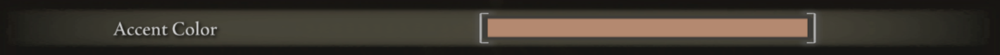
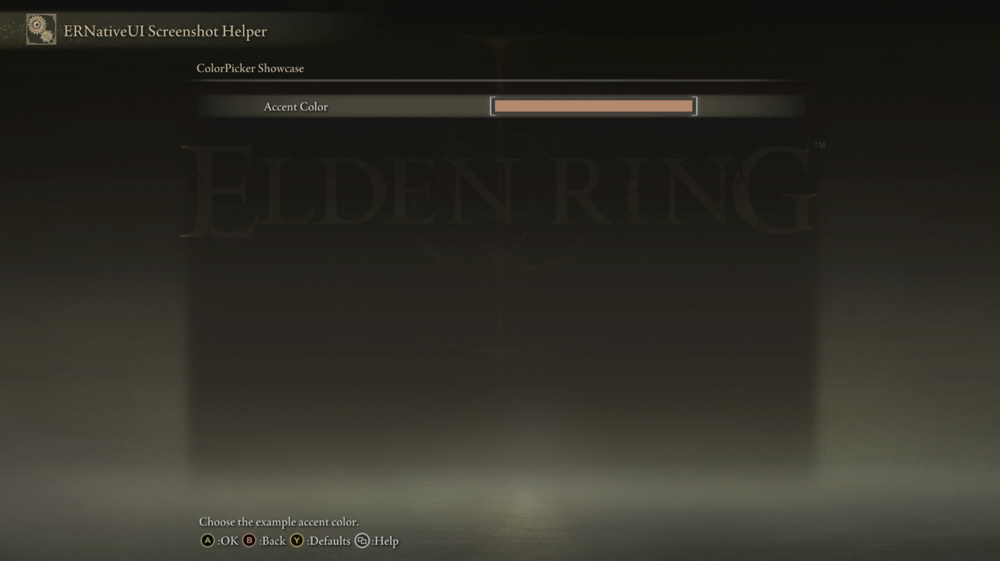
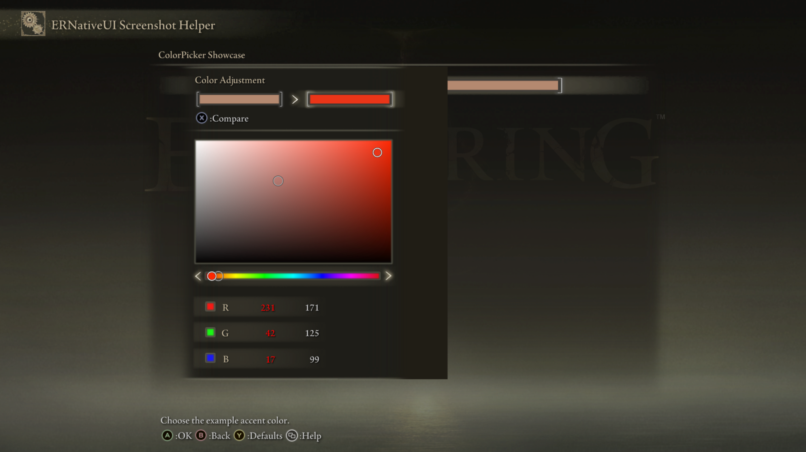
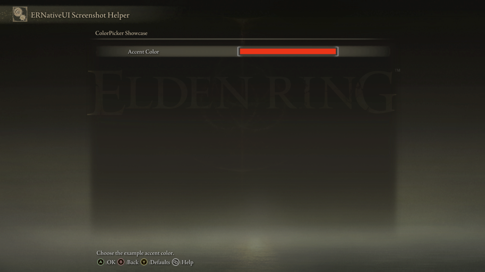

# ColorPicker

A `ColorPicker` adds an RGB color row to an `erui::Page`. Confirm opens Elden
Ring's native character-creation color editor, and the row displays the last
confirmed color.



*The left text is the row label. The bracketed swatch on the right displays
the current red, green, and blue values.*

## Minimal example

This example adds the `Accent Color` row shown above, initially using RGB
`(171, 125, 99)`:

```cpp
#include <ernativeui/ERNativeUI.hpp>

erui::RowHandle add_accent_color_picker(erui::Page page) noexcept
{
    erui::ColorPickerOptions options{};
    options.initial_value = {171, 125, 99};

    return page.add_color_picker(
        L"Accent Color",
        L"Choose the example accent color.",
        options);
}
```

Call `add_accent_color_picker(page)` from the menu-builder body. Its argument
is the `erui::Page` on which the row should appear. The returned
`erui::RowHandle` identifies this ColorPicker if the mod needs to read or
change its color after registration. The
[first-mod guide](../../getting-started/first-mod.md) shows the complete
menu-builder context.

No callback is required. ERNativeUI owns the current color and keeps the live
swatch updated. The local `options` object may be destroyed after the call.



*The minimal example displays its initial RGB color in a native bracketed
swatch.*

## What the native editor looks like

Confirming the ColorPicker row first opens Elden Ring's palette. The player
can choose a temporary color or one of the preset colors:


*This is the first screen opened by the ColorPicker. Confirm accepts the
highlighted color, while Back cancels the editor.*

The **Adjust color** command, shown as **Y** with Xbox prompts or **Triangle**
with PlayStation prompts, opens the detailed editor:



*The detailed editor exposes the two-dimensional color field, hue bar, and
red, green, and blue values. Confirming returns the chosen RGB color to the
ColorPicker row.*

## API at a glance

The callback-free form is:

```cpp
erui::ColorPickerOptions options{};

const erui::RowHandle picker =
    page.add_color_picker(label, help_message, options);
```

Here, `page` is an `erui::Page`; `label` and `help_message` are UTF-16; and the
return type is `erui::RowHandle`.

## Reacting to a confirmed color

Use the stateful C++ overload when the client mod needs its own copy of the
player's confirmed color:

```cpp
#include <ernativeui/ERNativeUI.hpp>

#include <mutex>

struct ModState {
    std::mutex mutex;
    erui::Color accent{171, 125, 99};
};

ModState g_state; // Must outlive the committed provider.

void accent_color_changed(
    ModState& state,
    const erui::ColorPickerChange& change) noexcept
{
    try {
        std::lock_guard<std::mutex> lock(state.mutex);
        state.accent = change.value;
    } catch (...) {
        // Never let an exception cross the callback boundary.
    }
}

erui::RowHandle add_accent_color_picker_with_callback(
    erui::Page page,
    ModState& state) noexcept
{
    erui::ColorPickerOptions options{};
    options.initial_value = {171, 125, 99};

    return page.add_color_picker<&accent_color_changed>(
        L"Accent Color",
        L"Choose the color used by this mod.",
        options,
        state);
}
```

Call `add_accent_color_picker_with_callback(page, g_state)` from the menu
builder. The callback must have exactly this shape:

```cpp
void callback(
    ModState& state,
    const erui::ColorPickerChange& change) noexcept;
```

`change.value` is a small copied `erui::Color`, so assigning it is safe.
ColorPicker callbacks run on the ERNativeUI worker; synchronize state shared
with other threads and keep the callback short.



*The row's swatch updates after the player confirms the editor.*

## Parameters

| Parameter | Meaning | Default or rule |
|---|---|---|
| `label` | Text shown on the left side of the row | Required, non-empty UTF-16; copied during the call |
| `help_message` | Contextual help shown by Elden Ring | May be empty; copied during the call |
| `options` | Initial RGB value and enabled state | Required `erui::ColorPickerOptions` value |
| `&callback` | Function called after a changed confirmation | Optional C++ template argument |
| `state` | Client-owned object passed to a stateful callback | Optional; must outlive the committed provider |

## `ColorPickerOptions` and `Color`

| Member | Default | Meaning and constraints |
|---|---:|---|
| `initial_value` | `{0, 0, 0}` | Initial red, green, and blue values |
| [`enabled`](options/enabled.md) | `true` | `false` omits the row completely |

`erui::Color` contains three `std::uint8_t` members named `red`, `green`, and
`blue`, so every channel is naturally limited to `0..255`. It intentionally
hides Elden Ring's private packed representation and does not promise an alpha
channel.

## Availability

[Availability and capabilities](../availability.md) explains how to read this
table and check host support.

| Property | Value |
|---|---|
| First public API | 1.1 |
| Capability | `erui::Capability::color_picker` / `ERUI_CAP_COLOR_PICKER` |
| Optional GFX | `02_040` and `02_042` provide the standalone bracketed live swatch |
| Disabled behavior | `enabled = false` omits the row because this action path has no proven disabled appearance |
| Runtime value | `erui::Color` with byte-sized red, green, and blue channels |

The native color editor remains functional without the optional GFX files,
but the settings row will not have the matching character-creation swatch.
See [Presentation and optional GFX assets](../presentation-and-gfx.md).

## Value and confirmation behavior

- Every ColorPicker row owns independent color state.
- Confirming a changed color updates the canonical value and queues one
  callback.
- Canceling the editor or confirming an unchanged color does not call the
  callback.
- `Registration::get_color` copies the current RGB value.
- `Registration::set_color` updates the canonical value without invoking the
  callback. The optional native swatch catches up at a later safe UI boundary.
- A programmatic write made while the editor is open survives Cancel. A later
  player confirmation replaces it.

Only one ERNativeUI ColorPicker editor can be outstanding process-wide. The
host coordinates it with native alerts so the two modal systems do not compete
for input.

## Common mistakes

- Treating the value as ARGB or RGBA, or depending on the game's private packed
  representation.
- Assuming two rows share a value because they start with the same color.
- Expecting `enabled = false` to display a grey swatch; it removes the row.
- Blocking inside the change callback while waiting for another modal to
  finish.
- Treating the optional GFX skin as necessary for editor functionality.

[Controls index](README.md) |
[Reverse-engineering reference](../../research/case-studies/color-picker.md) |
Previous: [TextInput](text-input.md) |
Next: [Controls index](README.md)
