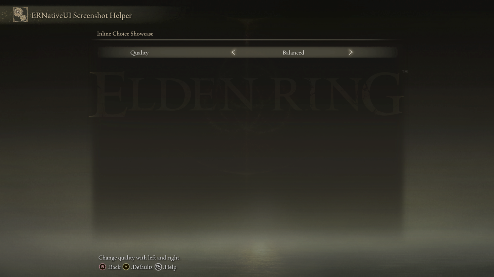

# Inline Choice

An `Inline Choice` displays one label from a fixed list on an `erui::Page`.
The player presses left or right to select another label without opening a
popup.


*The row label is **Quality**. The selected option is **Balanced**, with
left/right arrows showing how the player changes it.*

## Minimal example

This example creates the row shown above. The available labels are
**Minimal**, **Balanced**, **Detailed**, and **Maximum**:

```cpp
#include <ernativeui/ERNativeUI.hpp>

#include <array>
#include <string_view>

erui::RowHandle add_quality_choice(erui::Page page) noexcept
{
    constexpr std::array<std::wstring_view, 4> quality_labels{
        L"Minimal",
        L"Balanced",
        L"Detailed",
        L"Maximum"};

    erui::ChoiceOptions quality_options{};
    quality_options.values = quality_labels.data();
    quality_options.count = quality_labels.size();
    quality_options.initial_index = 1;

    return page.add_inline_choice(
        L"Quality",
        L"Change quality with left and right.",
        quality_options);
}
```

Call `add_quality_choice(menu.root())` from the menu-builder body. The builder
receives `menu` as an `erui::Menu&`; `Menu::root()` returns the root
`erui::Page`. Pass another `erui::Page` when the choice belongs on a different
page. The [first-mod guide](../../getting-started/first-mod.md) shows the
complete menu-builder context.

The function returns an `erui::RowHandle`, which identifies this particular
choice after registration. The initial index is zero-based: `0` means
**Minimal**, so `1` selects **Balanced**.



*The minimal example starts on `Balanced`, exactly as selected by
`initial_index = 1`.*

## API at a glance

The recommended callback-free form is:

```cpp
const erui::RowHandle choice = page.add_inline_choice(
    label,
    help_message,
    choice_options);
```

Here, `page` has type `erui::Page`, `choice_options` has type
`erui::ChoiceOptions`, and the return value has type `erui::RowHandle`.

The C++17 wrapper's complete function shape is:

```cpp
erui::RowHandle erui::Page::add_inline_choice(
    std::wstring_view label,
    std::wstring_view help_message,
    const erui::ChoiceOptions& options,
    erui::ValueChangedCallback callback = nullptr,
    void* user_data = nullptr) noexcept;
```

`ChoiceOptions` connects a contiguous array of visible labels to a zero-based
initial index:

```cpp
struct erui::ChoiceOptions {
    const std::wstring_view* values{};
    std::size_t count{};
    std::uint8_t initial_index{0};
};
```

## Reacting to player changes

The optional callback receives the newly selected zero-based index. This
example starts from mod-owned state and updates that state after the player
changes the row:

```cpp
#include <ernativeui/ERNativeUI.hpp>

#include <array>
#include <atomic>
#include <cstdint>
#include <string_view>

struct ModState {
    std::atomic_uint8_t quality_index{1};
};

ModState g_state; // Must outlive the committed provider.

void quality_changed(
    void* state_pointer,
    std::uint8_t selected_index) noexcept
{
    ModState& state = *static_cast<ModState*>(state_pointer);
    state.quality_index.store(
        selected_index,
        std::memory_order_release);
}

erui::RowHandle add_quality_choice_with_callback(
    erui::Page page,
    ModState& state) noexcept
{
    constexpr std::array<std::wstring_view, 4> quality_labels{
        L"Minimal",
        L"Balanced",
        L"Detailed",
        L"Maximum"};

    erui::ChoiceOptions quality_options{};
    quality_options.values = quality_labels.data();
    quality_options.count = quality_labels.size();
    quality_options.initial_index =
        state.quality_index.load(std::memory_order_acquire);

    return page.add_inline_choice(
        L"Rendering Quality",
        L"Choose the rendering quality preset.",
        quality_options,
        &quality_changed,
        &state);
}
```

Call `add_quality_choice_with_callback(page, g_state)` from the menu-builder
body with the destination `erui::Page`. Validate an index loaded from a file
before registration because `initial_index` must be smaller than `count`.

The callback must have this shape:

```cpp
void callback(void* user_data, std::uint8_t selected_index) noexcept;
```

`user_data` receives the same address passed after the callback in
`add_inline_choice`. The callback runs on the ERNativeUI worker, so the
example uses an atomic value for state that other threads may also read.
Keep the returned `erui::RowHandle` if the mod will later call
`erui::Registration::get_value` or `set_value` for this row.

## Parameters and `ChoiceOptions`

| Parameter or member | Meaning | Default or rule |
|---|---|---|
| `label` | Text shown on the left side of the row | Required, non-empty UTF-16; copied during the call |
| `help_message` | Contextual help shown by Elden Ring | May be empty; copied during the call |
| `values` | Pointer to a contiguous array of `std::wstring_view` labels | Required; every label must be non-empty valid UTF-16 |
| `count` | Number of labels in `values` | Must be from `1` through `32` |
| `initial_index` | Label selected when the menu is committed | Defaults to `0`; must be less than `count` |
| `callback` | Optional `erui::ValueChangedCallback` notified after player changes | Defaults to `nullptr` |
| `user_data` | Client-owned pointer returned to `callback` | Defaults to `nullptr`; must remain valid for the callback lifetime |

ERNativeUI copies the array and every label before `add_inline_choice`
returns. A local `std::array`, like the arrays above, does not need to outlive
the menu-builder call.

Inline Choice has no public [`enabled`](options/enabled.md) setting. A safe
native disabled presentation has not been established for this row type.

## Callback behavior

The callback is optional. Without one, the player can still change the choice
and ERNativeUI still owns its current index.

When supplied, an `erui::ValueChangedCallback` receives the client-owned
`user_data` pointer and the newly selected zero-based `std::uint8_t` index.
ERNativeUI dispatches it on the host worker after observing a player change.
The callback is not invoked for the initial value or by
`Registration::set_value`.


*One right input advances the zero-based selection from `Balanced` to
`Detailed` without opening another screen.*

The current C++17 header does not provide a template/state callback overload
for Inline Choice. Use the callback and state-pointer form demonstrated above
when the mod needs immediate change notifications.

## Availability

[Availability and capabilities](../availability.md) explains how to read this
table and check host support.

| Property | Value |
|---|---|
| First public API | 1.0 |
| Capability | `erui::Capability::inline_choice` / `ERUI_CAP_INLINE_CHOICE` |
| Optional GFX | None required |
| Runtime value | Zero-based `std::uint8_t` option index |

## Value and lifetime behavior

- Left/right changes the host-owned current index and visible label.
- `Registration::get_value` returns that same zero-based index.
- `Registration::set_value` accepts an in-range index, changes the visible
  label silently, and does not invoke the optional callback.
- Choice labels and the options array are copied during the builder call.
- An optional callback and its `user_data` are not copied. Their code and
  pointed-to state must remain valid until process exit after a successful
  commit.
- If the call is rejected, it returns `ERUI_INVALID_ROW` and causes the
  surrounding registration to fail instead of publishing a partial menu.

## Common mistakes

- Using one-based indices. Every public choice index is zero-based.
- Supplying zero labels, more than 32 labels, or an empty label.
- Setting `initial_index` to `count` or greater.
- Keeping the local label array alive unnecessarily; ERNativeUI has already
  copied it when the call returns.
- Expecting Inline Choice to open a list. Use
  [Popup Choice](popup-choice.md) when all labels should appear together.
- Expecting a disabled option or a callback from `Registration::set_value`.

[Controls index](README.md) |
[Reverse-engineering reference](../../research/case-studies/popup-choice.md) |
Previous: [Slider](slider.md) |
Next: [Popup Choice](popup-choice.md)
