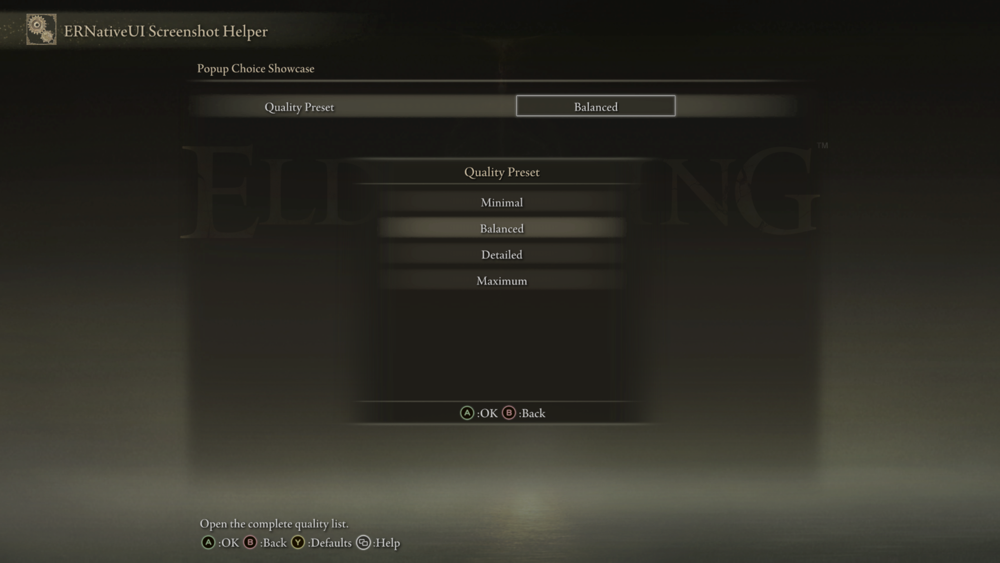

# Popup Choice

A Popup Choice adds a named setting to an `erui::Page`. Confirm opens Elden
Ring's native selection list, allowing the player to see every label before
choosing one.


*The left text is the row label. The framed value on the right is the current
selection; confirming it opens the complete list.*

## Minimal example

This example adds the `Quality Preset` row shown above. It contains four
choices and starts on `Balanced`, whose zero-based index is `1`:

```cpp
#include <ernativeui/ERNativeUI.hpp>

#include <array>
#include <string_view>

erui::RowHandle add_quality_preset(erui::Page page) noexcept
{
    constexpr std::array<std::wstring_view, 4> labels{
        L"Minimal",
        L"Balanced",
        L"Detailed",
        L"Maximum"};

    erui::ChoiceOptions options{};
    options.values = labels.data();
    options.count = labels.size();
    options.initial_index = 1;

    return page.add_popup_choice(
        L"Quality Preset",
        L"Open the complete quality list.",
        options);
}
```

Call `add_quality_preset(page)` from the menu-builder body. Its argument is the
`erui::Page` on which the row should appear. The returned `erui::RowHandle`
identifies this Popup Choice if the mod needs to read or change its selected
index after registration. The
[first-mod guide](../../getting-started/first-mod.md) shows the complete
menu-builder context.

ERNativeUI copies both the array and every label during `add_popup_choice`, so
the local `labels` and `options` objects may be destroyed when the function
returns.



*Confirming the row opens all four labels and initially highlights
`Balanced`.*

## API at a glance

The callback-free form is:

```cpp
erui::ChoiceOptions options{};
// Assign options.values, options.count, and options.initial_index.

const erui::RowHandle choice =
    page.add_popup_choice(label, help_message, options);
```

Here, `page` is an `erui::Page`; `label`, `help_message`, and the option labels
are UTF-16; and the return type is `erui::RowHandle`.

The C++17 wrapper's complete function shape is:

```cpp
erui::RowHandle erui::Page::add_popup_choice(
    std::wstring_view label,
    std::wstring_view help_message,
    const erui::ChoiceOptions& options,
    erui::ValueChangedCallback callback = nullptr,
    void* user_data = nullptr) noexcept;
```

## Reacting to a confirmed choice

The optional callback receives the newly selected zero-based index. This
example stores it in thread-safe client-owned state:

```cpp
#include <ernativeui/ERNativeUI.hpp>

#include <array>
#include <atomic>
#include <cstdint>
#include <string_view>

struct ModState {
    std::atomic_uint8_t quality_preset{1};
};

ModState g_state; // Must outlive the committed provider.

void quality_preset_changed(
    void* state_pointer,
    std::uint8_t selected_index) noexcept
{
    ModState& state = *static_cast<ModState*>(state_pointer);
    state.quality_preset.store(
        selected_index,
        std::memory_order_release);
}

erui::RowHandle add_saved_quality_preset(
    erui::Page page,
    ModState& state) noexcept
{
    constexpr std::array<std::wstring_view, 4> labels{
        L"Minimal",
        L"Balanced",
        L"Detailed",
        L"Maximum"};

    erui::ChoiceOptions options{};
    options.values = labels.data();
    options.count = labels.size();
    options.initial_index =
        state.quality_preset.load(std::memory_order_acquire);

    return page.add_popup_choice(
        L"Quality Preset",
        L"Choose this mod's quality preset.",
        options,
        &quality_preset_changed,
        &state);
}
```

Call `add_saved_quality_preset(page, g_state)` from the menu builder. The
callback must have this shape:

```cpp
void callback(void* user_data, std::uint8_t selected_index) noexcept;
```

`user_data` receives the same address passed after the callback in
`add_popup_choice`. Popup Choice callbacks run on the ERNativeUI worker, so
synchronize state shared with other threads and keep the callback short.

## Parameters

| Parameter | Meaning | Default or rule |
|---|---|---|
| `label` | Text shown on the left side of the row | Required, non-empty UTF-16; copied during the call |
| `help_message` | Contextual help shown by Elden Ring | May be empty; copied during the call |
| `options` | Labels and initial selected index | Required `erui::ChoiceOptions` value |
| `callback` | Function notified after ERNativeUI observes a changed selection | Optional; defaults to `nullptr` |
| `user_data` | Client-owned pointer returned to `callback` | Optional; its target must outlive the committed provider |

## `ChoiceOptions`

| Member | Default | Meaning and constraints |
|---|---:|---|
| `values` | `nullptr` | Pointer to a contiguous array of `std::wstring_view` labels |
| `count` | `0` | Number of labels; must be from `1` through `32` |
| `initial_index` | `0` | Zero-based starting index; must be less than `count` |

Every label must be non-empty. Popup Choice has no public `enabled` member; if
the row should not exist, conditionally omit its `add_popup_choice` call. See
[Enabled controls](options/enabled.md).

## Availability

[Availability and capabilities](../availability.md) explains how to read this
table and check host support.

| Property | Value |
|---|---|
| First public API | 1.0 |
| Capability | `erui::Capability::popup_choice` / `ERUI_CAP_POPUP_CHOICE` |
| Optional GFX | Not required; the optional `02_040` asset supplies a matching left label on affected action rows |
| Enabled option | Not exposed |
| Runtime value | Zero-based `std::uint8_t` option index |

## Value and confirmation behavior

- Opening the list does not change the selected index.
- Confirming a different label updates the index and queues one callback.
- Canceling the list or confirming its current label does not call the
  callback.
- `Registration::get_value` copies the current zero-based index.
- `Registration::set_value` changes the selected index silently and rejects
  an index greater than or equal to `count`. A programmatic write does not
  invoke the callback.

Popup Choice supports up to 32 labels. It is usually clearer than Inline
Choice when the set is large enough that the player benefits from seeing every
label at once:


*The same control can display a larger named set without requiring the player
to cycle through every intermediate value.*

## Common mistakes

- Passing a one-based index instead of a zero-based index.
- Keeping `values` null, using an empty label, or declaring more than 32
  labels.
- Allowing `initial_index` to equal or exceed `count`.
- Treating Cancel or unchanged confirmation as a change notification.
- Using a Popup Choice for two or three labels that are faster to cycle inline.

[Controls index](README.md) |
[Reverse-engineering reference](../../research/case-studies/popup-choice.md) |
Previous: [Inline Choice](inline-choice.md) |
Next: [TextInput](text-input.md)
