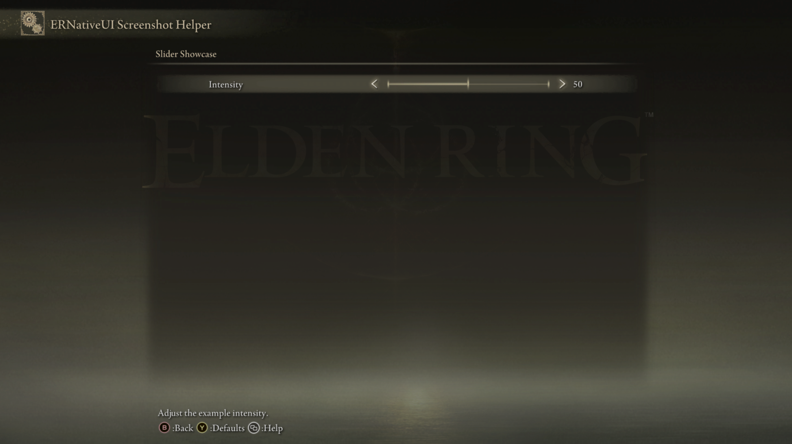

# Slider

A Slider adds a native left/right control to an `erui::Page`. Use it for a
bounded whole-number setting such as effect strength, distance, or volume.


*The row label is on the left. Elden Ring shows the adjustable bar, arrows,
and current value on the right.*

## Minimal example

This is the Slider shown above. It starts at `50`, accepts values from `0`
through `100`, and moves in steps of `5`:

```cpp
#include <ernativeui/ERNativeUI.hpp>

erui::RowHandle add_intensity_slider(erui::Page page) noexcept
{
    erui::SliderOptions options{};
    options.minimum = 0;
    options.maximum = 100;
    options.step = 5;
    options.initial_value = 50;

    return page.add_slider(
        L"Intensity",
        L"Adjust the example intensity.",
        options);
}
```

Call `add_intensity_slider(page)` from the menu-builder body. Its argument is
the `erui::Page` on which the row should appear; choosing that argument chooses
the Slider's location. The
[first-mod guide](../../getting-started/first-mod.md) shows where the builder
receives or creates pages. This guide starts with a `Page` so unrelated
connection and menu setup does not hide the Slider call.

`SliderOptions` contains the starting value and the rules for changing it.
The minimal Slider has no callback, but ERNativeUI still owns and updates its
value when the player uses left or right.

The exact return type is `erui::RowHandle`. Keep this handle if the mod will
later read or change the Slider through its `erui::Registration`; otherwise,
it may be discarded.



*The screenshot helper places the single Slider on its own page so the row is
easy to identify.*

## API at a glance

The recommended callback-free call shape is:

```cpp
erui::SliderOptions options{};
// Configure the range and initial value.

const erui::RowHandle slider = page.add_slider(
    L"Row label",
    L"Help shown for this row.",
    options);
```

The first argument is the visible label, the second is Elden Ring's contextual
help text, and the third describes the value range. The label must not be
empty; the help text may be empty. Both strings are copied during the call.

An optional change callback and its state pointer may follow `options`. The
C++ wrapper names that function-pointer type `erui::ValueChangedCallback`.
Slider does not currently provide a templated change-callback overload.

The C++17 wrapper's full function shape is:

```cpp
erui::RowHandle erui::Page::add_slider(
    std::wstring_view label,
    std::wstring_view help_message,
    const erui::SliderOptions& options,
    erui::ValueChangedCallback callback = nullptr,
    void* user_data = nullptr) noexcept;
```

The optional callback has this source-level shape:

```cpp
void callback(void* user_data, std::uint8_t value) noexcept;
```

## React to player changes

A real mod normally starts the Slider from its current setting and copies each
player change back into mod-owned state:

```cpp
#include <ernativeui/ERNativeUI.hpp>

#include <atomic>
#include <cstdint>

struct ModSettings {
    std::atomic<std::uint8_t> intensity{50};
};

ModSettings g_settings; // Must outlive the committed menu.

void intensity_changed(void* state_pointer, std::uint8_t value) noexcept
{
    ModSettings& settings =
        *static_cast<ModSettings*>(state_pointer);
    settings.intensity.store(value, std::memory_order_release);
}

erui::RowHandle add_effect_intensity_slider(erui::Page page) noexcept
{
    erui::SliderOptions options{};
    options.minimum = 0;
    options.maximum = 100;
    options.step = 5;
    options.initial_value =
        g_settings.intensity.load(std::memory_order_acquire);

    return page.add_slider(
        L"Effect Intensity",
        L"Adjust this mod's effect strength.",
        options,
        &intensity_changed,
        &g_settings);
}
```

Call `add_effect_intensity_slider(settings_page)` inside the registration
builder, where `settings_page` is the destination `erui::Page`.

`&g_settings` is passed through ERNativeUI unchanged. When the player changes
the Slider, `state_pointer` receives that same address and the callback stores
the new byte. The callback runs on ERNativeUI's worker, so the example uses an
atomic value for state that other threads may also read. Keep this callback
short and never allow an exception to escape it.


*The native row advances by the configured step of `5`.*

## Parameters

| Argument | Meaning | Default or rule |
|---|---|---|
| `label` | Player-facing row label | Required, non-empty UTF-16; copied during the call |
| `help` | Contextual help shown by Elden Ring | May be empty; copied during the call |
| `options` | Range, step, starting value, and enabled state | Required `erui::SliderOptions` |
| `callback` | Receives the value after ERNativeUI observes a change | Optional; omit it when the mod does not need a notification |
| `user_data` | Address returned to the callback as its first argument | Optional; when used, its target must outlive the committed provider |

## `SliderOptions`

| Member | Default | Meaning and constraints |
|---|---:|---|
| `minimum` | `0` | Inclusive lower bound; must be from `0` through `255` |
| `maximum` | `100` | Inclusive upper bound; must be from `minimum` through `255` |
| `step` | `1` | Positive increment measured from `minimum` |
| `initial_value` | `0` | Starting byte; must be inside the inclusive range; an off-step value rounds down to the previous step |
| [`enabled`](options/enabled.md) | `true` | `false` leaves a disabled row visible and still consumes a page slot |

Choose an `initial_value` on the step sequence beginning at `minimum`. For
example, `minimum = 10` and `step = 6` produce `10`, `16`, `22`, and so on up
to the last value not greater than `maximum`.

All options are copied while the menu is being built. Changing the local
`SliderOptions` object afterward does not reconfigure the committed row.

## Availability

[Availability and capabilities](../availability.md) explains how to read this
table and check host support.

| Property | Value |
|---|---|
| First public API | 1.0 |
| Capability | `erui::Capability::slider` / `ERUI_CAP_SLIDER` |
| Optional GFX | None required |
| Disabled behavior | Remains visible and uses Elden Ring's native disabled state |
| Runtime value | `std::uint8_t` inside the declared range |

## Value and lifetime behavior

- Player input moves among the values on the declared step sequence. After a
  change, ERNativeUI updates its canonical byte and invokes the optional
  callback on its worker.
- ERNativeUI normalizes an off-step `initial_value` down to the previous step
  before publication and does not invoke the callback for that initialization.
- `Registration::get_value(slider, value)` copies the current canonical byte.
- `Registration::set_value(slider, value)` clamps the byte to the declared
  range, rounds it down to a step measured from `minimum`, and updates the
  native presentation without invoking the callback. The callback reports
  player changes, not programmatic writes made by the client mod.
- The `RowHandle` identifies this row only within its owning provider. Use it
  with the `Registration` returned by that provider's successful commit.
- The `Page` builder is only valid while its registration draft is open. The
  returned `RowHandle` is the value intended for post-commit access.
- ERNativeUI copies Slider text and options, but it cannot copy callback code
  or the object addressed by `user_data`. Those must remain valid until
  process exit after a successful commit; do not hot-unload the client DLL.
- [`enabled`](options/enabled.md) is fixed when the provider commits. It cannot
  be toggled later in API 1.1.
- A rejected call on an active, valid menu draft returns `ERUI_INVALID_ROW`
  and causes that registration to fail instead of publishing a partial menu.

A step does not need to divide the range evenly. With `minimum = 10`,
`maximum = 20`, and `step = 6`, the reachable values are `10` and `16`.
Setting `20` programmatically therefore stores `16`.

## Common mistakes

- Passing an `initial_value` outside the range. Registration rejects the menu
  draft instead of publishing a partially valid provider.
- Using `step = 0` or a negative step.
- Expecting a floating-point or signed runtime value. The native Slider owns
  one byte, so the complete public domain is `0..255`.
- Choosing an off-step initial value and assuming it will remain off-step.
- Letting callback state go out of scope after the builder returns.
- Blocking in the change callback or touching game state that belongs to a
  different thread.
- Expecting `enabled = false` to hide the row. A disabled Slider remains
  visible and consumes pagination capacity; see
  [Enabled controls](options/enabled.md).

[Controls index](README.md) |
[Reverse-engineering reference](../../research/case-studies/settings-pages-and-pagination.md) |
Previous: [Toggle](toggle.md) |
Next: [Inline Choice](inline-choice.md)
