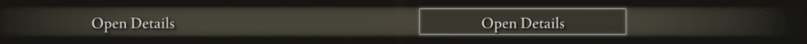
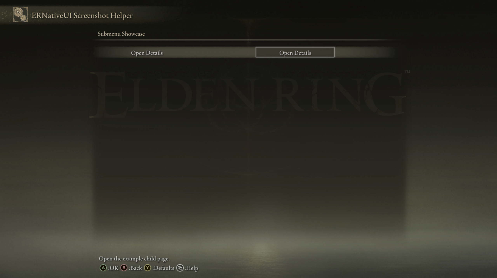
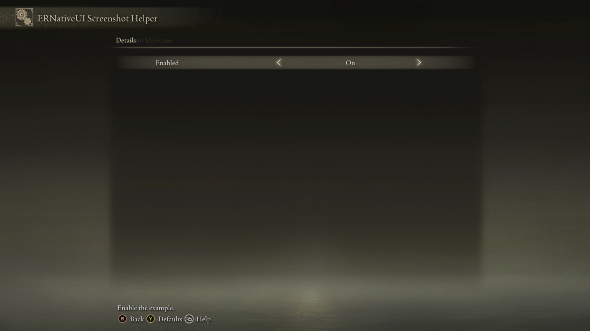

# Submenu

A `Submenu` adds a navigation row to an `erui::Page`. Confirming the row opens
a new child `erui::Page` owned by the same mod. Unlike the other controls,
`Page::add_submenu` returns that child page instead of an `erui::RowHandle`.



*The left text is the row label. The framed action on the right opens the
child page.*

## Minimal example

This example adds the **Open Details** row shown above and puts one Toggle on
the page it opens:

```cpp
#include <ernativeui/ERNativeUI.hpp>

void add_details_submenu(erui::Page parent_page) noexcept
{
    erui::Page details_page = parent_page.add_submenu(
        L"Open Details",
        L"Open the example child page.",
        L"Details");

    details_page.add_toggle(
        L"Enabled",
        L"Enable the example.",
        1);
}
```

Call `add_details_submenu(menu.root())` from the menu-builder body. The
builder receives `menu` as an `erui::Menu&`, and `Menu::root()` returns the
root `erui::Page` for this mod. Passing another `erui::Page` would place the
same Submenu on that page instead. The
[first-mod guide](../../getting-started/first-mod.md) shows the complete
menu-builder context.

`parent_page.add_submenu(...)` creates two related things: the visible row on
`parent_page` and the child `erui::Page` returned as `details_page`. Add child
controls to `details_page`, not to `parent_page`.



*The parent page contains only the `Open Details` navigation row.*



*Confirming the row opens the returned child page, where the example added its
`Enabled` Toggle.*

## API at a glance

The recommended form names the parent row and the page it opens:

```cpp
erui::Page child_page = parent_page.add_submenu(
    label,
    help_message,
    page_title,
    page_help);
```

Here, `parent_page` and `child_page` both have type `erui::Page`. The return
value is deliberately not a row handle: it is the builder used to populate
the new page.

The complete C++ wrapper signature is:

```cpp
erui::Page erui::Page::add_submenu(
    std::wstring_view label,
    std::wstring_view help_message,
    std::wstring_view page_title = {},
    std::wstring_view page_help = {},
    bool enabled = true) noexcept;
```

When `page_title` is empty, ERNativeUI uses `label` as the child title. When
`page_help` is empty, it uses the parent row's `help_message` as the child-page
help.

## Building a larger child page

The returned page accepts the same controls as any other `erui::Page`. This
example builds an advanced page containing a Toggle and a Slider:

```cpp
#include <ernativeui/ERNativeUI.hpp>

erui::Page add_advanced_page(erui::Page parent_page) noexcept
{
    erui::Page advanced_page = parent_page.add_submenu(
        L"Advanced Settings",
        L"Open this mod's advanced settings.",
        L"My Mod - Advanced",
        L"Configure this mod's advanced behavior.");

    advanced_page.add_toggle(
        L"Enabled",
        L"Enable the advanced behavior.",
        1);

    erui::SliderOptions strength_options{};
    strength_options.minimum = 0;
    strength_options.maximum = 100;
    strength_options.step = 5;
    strength_options.initial_value = 50;

    advanced_page.add_slider(
        L"Strength",
        L"Adjust the advanced effect strength.",
        strength_options);
    return advanced_page;
}
```

Call `add_advanced_page(menu.root())` from the menu-builder body. Returning
`advanced_page` is optional, but it lets the caller add more rows or apply
[custom page presentation](../presentation-and-gfx.md#customize-submenu-titles)
before the builder finishes.

## Parameters

Submenu has no separate options object.

| Parameter | Meaning | Default or rule |
|---|---|---|
| `label` | Text shown on the parent row | Required, non-empty UTF-16; copied during the call |
| `help_message` | Contextual help for the parent row | May be empty; copied during the call |
| `page_title` | Title shown on the child page | Empty uses `label` |
| `page_help` | Logical help text owned by the child page | Empty uses `help_message` |
| [`enabled`](options/enabled.md) | Whether to include the navigation row | Defaults to `true`; `false` omits the row and makes the child unreachable |

All four strings are copied while the builder call runs. They may therefore
come from temporary or local `std::wstring` objects that remain valid for the
duration of that call.

If ERNativeUI paginates the child, its default page titles use
`page_title (n/t)`.

## Availability

[Availability and capabilities](../availability.md) explains how to read this
table and check host support.

| Property | Value |
|---|---|
| First public API | 1.0 |
| Capability | `erui::Capability::submenu` / `ERUI_CAP_SUBMENU` |
| Optional GFX | Not required for navigation; the optional `02_040` asset supplies a matching left-label field on Game/Camera action rows |
| Runtime value | None; the call returns a child `erui::Page` builder |

## Navigation and lifetime behavior

- `add_submenu` adds the parent action row and its child page to the same
  private registration draft.
- `erui::Page` is a lightweight builder, not a runtime screen object. Populate
  it before the menu-builder callback returns.
- Labels, controls, nested pages, and presentation become fixed when the
  provider commits.
- Elden Ring and ERNativeUI own the native navigation. Confirm opens the child;
  Back returns to the real parent; ERNativeUI adds pagination when required.
- Submenu has no value, getter, setter, or client callback.
- `enabled = false` omits the navigation row. The child is unreachable and
  neither the row nor its child controls consume a visible pagination slot.
- If the call is rejected, it returns an invalid `erui::Page` and causes the
  surrounding registration to fail instead of publishing a partial menu.

## Common mistakes

- Adding the intended child controls to `parent_page` instead of the returned
  child page.
- Expecting `add_submenu` to return an `erui::RowHandle` like other controls.
- Retaining the child `erui::Page` after registration and trying to add rows
  dynamically.
- Expecting `enabled = false` to render a disabled navigation row.
- Building manual Back, Previous, or Next buttons instead of letting
  ERNativeUI own navigation and pagination.
- Confusing `page_title` with the optional outer `menu_title` configured by
  page presentation.

[Controls index](README.md) |
[Reverse-engineering reference](../../research/case-studies/settings-pages-and-pagination.md) |
Previous: [Button](button.md) |
Next: [Toggle](toggle.md)
