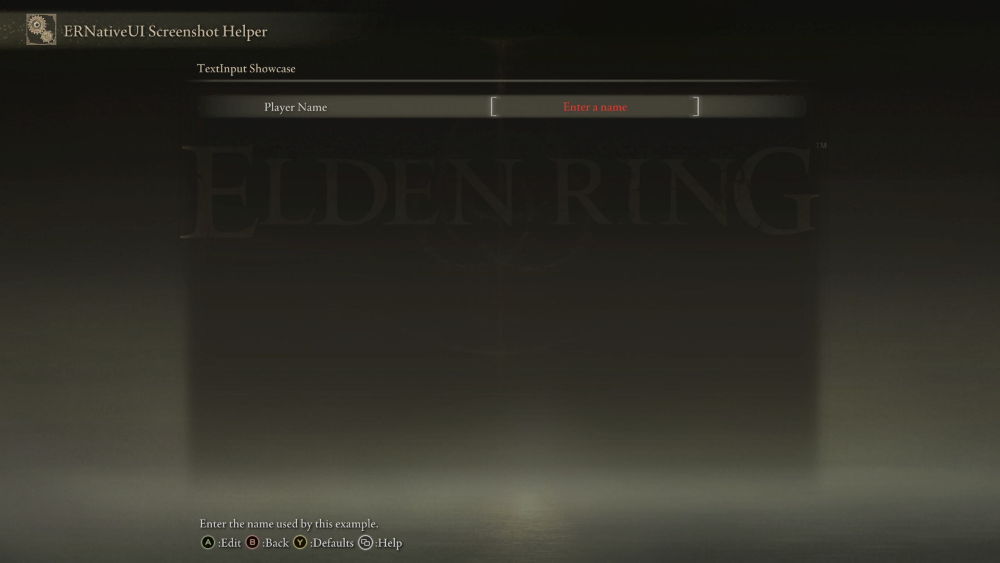

# TextInput

A `TextInput` adds an editable text row to an `erui::Page`. Confirm opens
Elden Ring's native text editor. The row shows either the last confirmed value
or a placeholder while its value is empty.


*The left text is the row label. The red text inside brackets is the
placeholder shown while the confirmed value is empty.*

## Minimal example

This example adds the `Player Name` row shown above:

```cpp
#include <ernativeui/ERNativeUI.hpp>

erui::RowHandle add_player_name_input(erui::Page page) noexcept
{
    erui::TextInputOptions options{};
    options.placeholder = L"Enter a name";
    options.maximum_length = 16;

    return page.add_text_input(
        L"Player Name",
        L"Enter the name used by this example.",
        options);
}
```

Call `add_player_name_input(page)` from the menu-builder body. Its argument is
the `erui::Page` on which the row should appear. The returned
`erui::RowHandle` identifies this TextInput if the mod needs to read or change
its value after registration. The
[first-mod guide](../../getting-started/first-mod.md) shows the complete
menu-builder context.

No callback is required. ERNativeUI owns the confirmed value even when the
client mod does not react to changes. The label, help message, placeholder,
and initial value are copied during `add_text_input`, so the local `options`
object does not need to outlive the call.



*The minimal example starts empty, so the page displays `Enter a name`.*

## API at a glance

The callback-free form is:

```cpp
erui::TextInputOptions options{};

const erui::RowHandle input =
    page.add_text_input(label, help_message, options);
```

Here, `page` is an `erui::Page`; `label`, `help_message`, and the strings in
`options` are UTF-16; and the return type is `erui::RowHandle`.

## Reacting to confirmed text

Use the stateful C++ overload when the client mod needs a copy of the player's
confirmed text:

```cpp
#include <ernativeui/ERNativeUI.hpp>

#include <mutex>
#include <string>

struct ModState {
    std::mutex mutex;
    std::wstring player_name;
};

ModState g_state; // Must outlive the committed provider.

void player_name_changed(
    ModState& state,
    const erui::TextInputChange& change) noexcept
{
    try {
        std::lock_guard<std::mutex> lock(state.mutex);
        state.player_name.assign(change.value);
    } catch (...) {
        // Never let an exception cross the callback boundary.
    }
}

erui::RowHandle add_player_name_input_with_callback(
    erui::Page page,
    ModState& state) noexcept
{
    erui::TextInputOptions options{};
    options.placeholder = L"Enter a name";
    options.maximum_length = 16;

    return page.add_text_input<&player_name_changed>(
        L"Player Name",
        L"Enter the name used by this mod.",
        options,
        state);
}
```

Call `add_player_name_input_with_callback(page, g_state)` from the menu
builder.
The callback must have exactly this shape:

```cpp
void callback(
    ModState& state,
    const erui::TextInputChange& change) noexcept;
```

`change.value` is a borrowed `std::wstring_view`. It is valid only during the
callback, which is why the example copies it into `state.player_name`.
TextInput callbacks run on the ERNativeUI worker, so synchronize state that
other threads also access and keep the callback short.


*After confirmation, the placeholder is replaced by the confirmed text.*

## Parameters

| Parameter | Meaning | Default or rule |
|---|---|---|
| `label` | Text shown on the left side of the row | Required, non-empty UTF-16; copied during the call |
| `help_message` | Contextual help shown by Elden Ring | May be empty; copied during the call |
| `options` | Initial text, placeholder, and length limit | Required `erui::TextInputOptions` value |
| `&callback` | Function called after a changed confirmation | Optional C++ template argument |
| `state` | Client-owned object passed to a stateful callback | Optional; must outlive the committed provider |

## `TextInputOptions`

| Member | Default | Meaning and constraints |
|---|---:|---|
| `initial_value` | Empty | Text displayed initially; it must fit `maximum_length` |
| `placeholder` | Empty | Text displayed while the confirmed value is empty |
| `maximum_length` | `16` | Inclusive limit from `1` through `35` UTF-16 code units; `0` also selects `16` |

`maximum_length` is fixed when the row is registered. It counts UTF-16 code
units, exactly like `std::wstring_view::size()` on Windows. It does not count
bytes, and one user-perceived character can occupy more than one code unit.
The placeholder does not consume any part of the limit.

## Availability

[Availability and capabilities](../availability.md) explains how to read this
table and check host support.

| Property | Value |
|---|---|
| First public API | 1.1 |
| Capability | `erui::Capability::text_input` / `ERUI_CAP_TEXT_INPUT` |
| Optional GFX | `02_040` and `02_042` provide the native brackets and red empty-state presentation |
| Enabled option | Not exposed; omit the `add_text_input` call when the row should not exist |
| Runtime value | Copied UTF-16 text |

The TextInput remains editable without the optional GFX files, but its visual
presentation will not match the character-name widget. See
[Presentation and optional GFX assets](../presentation-and-gfx.md).

## Value and confirmation behavior

- Confirming changed text updates the canonical value and queues one callback.
- Canceling the editor or confirming unchanged text does not call the callback.
- `Registration::get_text` copies the current value into a `std::wstring`.
- `Registration::set_text` copies a new value without invoking the callback
  and rejects over-limit text instead of truncating it. The visible row catches
  up at a later safe UI boundary.
- A programmatic write made while the editor is open survives Cancel. A later
  player confirmation replaces it.
- Values must contain valid UTF-16 and no embedded NUL code unit.

## Common mistakes

- Retaining `change.value.data()` or the borrowed view after the callback
  returns.
- Counting UTF-8 bytes or visible glyphs instead of Windows UTF-16 code units.
- Setting `initial_value` longer than the fixed maximum.
- Expecting `set_text` to truncate an oversized value or call the change
  callback.
- Assuming the optional GFX files provide behavior; they provide presentation.

[Controls index](README.md) |
[Reverse-engineering reference](../../research/case-studies/text-input.md) |
Previous: [Popup Choice](popup-choice.md) |
Next: [ColorPicker](color-picker.md)
