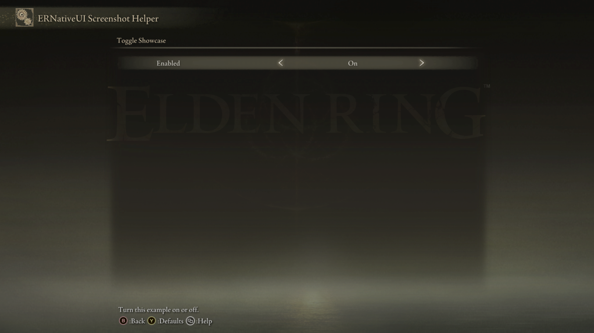

# Toggle

A `Toggle` adds an on/off setting to an `erui::Page`. The player changes it
with Elden Ring's left/right controls, and ERNativeUI stores the selected
state as `0` (Off) or `1` (On).


*The left text is the row label. The native control on the right shows the
current On or Off value.*

## Minimal example

This example creates exactly the Toggle shown above. It starts in the On
state and does not need a callback:

```cpp
#include <ernativeui/ERNativeUI.hpp>

erui::RowHandle add_enabled_toggle(erui::Page page) noexcept
{
    return page.add_toggle(
        L"Enabled",
        L"Turn this example on or off.",
        1);
}
```

Call `add_enabled_toggle(page)` from the menu-builder body. Its argument is
the `erui::Page` on which the row should appear; choosing that argument
chooses the Toggle's location. The
[first-mod guide](../../getting-started/first-mod.md) shows where the builder
receives or creates pages. This guide starts with a `Page` so unrelated
connection and menu setup does not hide the Toggle call.

The third argument is the initial value. Use `0` to start Off or `1` to start
On. ERNativeUI normalizes any other nonzero byte to `1`, so a Toggle never has
a third state.

The exact return type is `erui::RowHandle`. Keep this handle if the mod will
later read or change the Toggle through its `erui::Registration`; otherwise,
it may be discarded.



*The screenshot helper places the single Toggle on its own page so the row is
easy to identify.*

## API at a glance

The recommended form for a Toggle that the mod will read later is:

```cpp
const erui::RowHandle toggle =
    page.add_toggle(label, help_message, initial_value);
```

Here, `page` is an `erui::Page`; `label` and `help_message` are UTF-16 strings;
and `initial_value` is a `std::uint8_t`. The call returns an
`erui::RowHandle`.

The C++17 wrapper's full function shape is:

```cpp
erui::RowHandle erui::Page::add_toggle(
    std::wstring_view label,
    std::wstring_view help_message,
    std::uint8_t initial_value,
    erui::ValueChangedCallback callback = nullptr,
    void* user_data = nullptr,
    bool enabled = true) noexcept;
```

The optional callback has this source-level shape:

```cpp
void callback(void* user_data, std::uint8_t value) noexcept;
```

`value` is always `0` or `1`. `user_data` is the same pointer supplied to
`add_toggle`; it lets one callback reach state owned by the client mod.
Toggle does not currently provide a templated change-callback overload.

## Applying the setting immediately

This example controls a real mod option. The callback updates an atomic flag
that gameplay code can safely read from another thread:

```cpp
#include <ernativeui/ERNativeUI.hpp>

#include <atomic>
#include <cstdint>

struct ModState {
    std::atomic_bool damage_numbers_enabled{true};
};

ModState g_mod_state{}; // Lives until the game exits.

void damage_numbers_changed(
    void* user_data,
    std::uint8_t value) noexcept
{
    ModState* state = static_cast<ModState*>(user_data);
    state->damage_numbers_enabled.store(
        value != 0,
        std::memory_order_release);
}

erui::RowHandle add_damage_numbers_toggle(erui::Page page) noexcept
{
    const std::uint8_t initial_value =
        g_mod_state.damage_numbers_enabled.load(std::memory_order_acquire)
            ? 1u
            : 0u;

    return page.add_toggle(
        L"Damage Numbers",
        L"Show damage numbers above enemies.",
        initial_value,
        &damage_numbers_changed,
        &g_mod_state);
}

bool should_draw_damage_numbers() noexcept
{
    return g_mod_state.damage_numbers_enabled.load(
        std::memory_order_acquire);
}
```

Call `add_damage_numbers_toggle(page)` from the menu-builder body with the
destination `erui::Page`. Later, the mod's gameplay code can call
`should_draw_damage_numbers()` before drawing its overlay.

After the player changes this Toggle in the menu, ERNativeUI calls
`damage_numbers_changed` on its worker thread with `0` for Off or `1` for On.
The callback therefore updates only thread-safe client state; it does not call
thread-restricted Elden Ring code. `g_mod_state` has process lifetime, so the
`user_data` pointer remains valid for every future callback.


*Here the player changed `Enabled` from On to Off. ERNativeUI stored `0` and
called `damage_numbers_changed` because this example supplied that callback.*

## Parameters

Toggle has no separate options object.

| Parameter | Meaning | Default or rule |
|---|---|---|
| `label` | Text shown on the left of the row | Required, non-empty UTF-16; copied during the call |
| `help_message` | Contextual help shown by Elden Ring | May be empty; copied during the call |
| `initial_value` | State used when the menu is first published | `0` is Off; every nonzero byte becomes `1` (On) |
| `callback` | Function notified after ERNativeUI observes a changed value | Optional; defaults to `nullptr` |
| `user_data` | Client-owned pointer passed back to `callback` | Optional; defaults to `nullptr`; its target must outlive the committed menu |
| [`enabled`](options/enabled.md) | Whether the player may change the visible Toggle | Defaults to `true`; `false` renders a disabled row and still consumes a page slot |

## Reading and changing the value later

After registration succeeds, the returned row handle identifies this Toggle:

```cpp
std::uint8_t current_value{};
const ERUI_Result read_result =
    registration.get_value(toggle, current_value);

const ERUI_Result write_result =
    registration.set_value(toggle, 1);
```

Here, `registration` is the successful `erui::Registration`, and `toggle` is
the `erui::RowHandle` returned by `add_toggle`. Check each result against
`ERUI_OK` before using the value or assuming the write succeeded.

`get_value` returns the host's canonical `0` or `1`. `set_value` normalizes a
nonzero byte to `1` and stages the native presentation update. The right-hand
On/Off text can therefore update shortly after `set_value` returns rather
than during the call itself. This programmatic write is silent: it does not
invoke the Toggle callback.

## Availability

[Availability and capabilities](../availability.md) explains how to read this
table and check a capability in client code.

| Property | Value |
|---|---|
| First public API | 1.0 |
| Capability | `erui::Capability::toggle` / `ERUI_CAP_TOGGLE` |
| Optional GFX | None required |
| Runtime value | `std::uint8_t`, always normalized to `0` or `1` |

## Callback, value, and lifetime behavior

- ERNativeUI owns the canonical value after the provider commits.
- The host worker observes native value changes and invokes the optional
  callback with the normalized value. Synchronize any state shared with other
  threads.
- A callback is a notification, not storage: use `Registration::get_value`
  when the host's current canonical value is needed.
- `Registration::set_value` changes the canonical value and stages a visual
  update without invoking the callback. The callback reports player changes,
  not programmatic writes made by the client mod.
- ERNativeUI copies the label, help message, initial value, callback pointer,
  and `user_data` pointer during menu construction. It does not copy the
  object addressed by `user_data`.
- Callback code and client-owned callback state must remain valid until
  process exit after a successful commit. Do not hot-unload the client DLL.
- [`enabled`](options/enabled.md) is fixed at commit. It cannot be changed at
  runtime in API 1.1.
- A rejected call on an active, valid menu draft returns `ERUI_INVALID_ROW`
  and causes that registration to fail instead of publishing a partial menu.

## Common mistakes

- Using `2` as a third state; every nonzero value becomes On.
- Reading the initial C++ variable after commit and expecting it to follow the
  menu. Read the row through `Registration::get_value`, or update synchronized
  client state in the callback.
- Touching game objects from the worker callback without first handing the
  work to the game thread expected by those objects.
- Passing a pointer to a local variable as `user_data`; the local object is
  gone before the player can change the Toggle.
- Expecting `enabled = false` to remove the row. A disabled Toggle remains
  visible and consumes pagination capacity.
- Using a row handle from another provider or from a different control type
  with `get_value` or `set_value`.

[Controls index](README.md) |
[Reverse-engineering reference](../../research/case-studies/settings-pages-and-pagination.md) |
Previous: [Submenu](submenu.md) |
Next: [Slider](slider.md)
