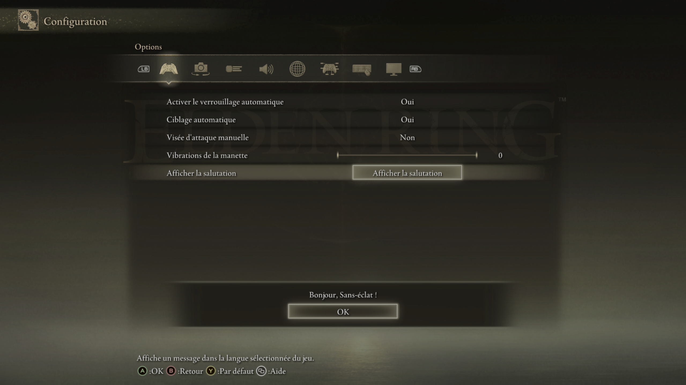

# Game language and localization

ERNativeUI reports Elden Ring's selected Steam language so a client mod can
choose its own translated text. ERNativeUI does not translate provider names,
row labels, help text, choice values, or dialog messages for the client.

This guide describes the current API 1.1 C++17 surface. Language discovery
first appeared in API 1.0 and remains available to any client built with the
1.0 SDK. A client that chooses API 1.1 uses its explicit connection lifecycle.
API versions and ERNativeUI release versions are independent. See the
[feature matrix](../features.md) and [versioning guide](../versioning.md).

## What ERNativeUI provides

The language API returns both:

- a known-language enum for every language currently advertised for Elden
  Ring on Steam; and
- Steam's exact UTF-8 language identifier, including a future identifier that
  the current enum does not recognize yet.

The known C++ values are `english`, `german`, `french`, `italian`, `korean`,
`spanish`, `chinese_simplified`, `chinese_traditional`, `russian`, `thai`,
`japanese`, `polish`, `arabic`, `portuguese_brazil`, and
`spanish_latin_america`. `GameLanguage::unknown` is a valid forward-compatible
classification, not necessarily an error.

ERNativeUI reads only the current Steam UI-language identifier. It does not
infer a language from the Windows locale, report the audio language, enumerate
available languages, or change the language while the game is running.

## Connect before selecting text

Call `erui::connect()` from a worker after `DllMain` returns. A successful API
1.1 connection means startup language discovery has settled, either with a
valid language or with a definitive unavailable result. Query the language
before registration when the provider display name also needs translation.

This example selects English or French text and retains English as its
fallback:

```cpp
#include <ernativeui/ERNativeUI.hpp>

struct Text {
    std::wstring_view mod_name;
    std::wstring_view show_notice;
    std::wstring_view notice;
};

constexpr Text kEnglish{
    L"My Mod",
    L"Show Notice",
    L"Apply the recommended settings?",
};

constexpr Text kFrench{
    L"Mon mod",
    L"Afficher le message",
    L"Appliquer les paramètres recommandés ?",
};

const Text& select_text(const erui::LanguageInfo& language) noexcept
{
    if (!language.available()) {
        return kEnglish;
    }

    switch (language.known) {
    case erui::GameLanguage::french:
        return kFrench;
    default:
        break;
    }

    // A mod may recognize a future or community token before ERNativeUI does.
    // Compare language.identifier here, then retain an English fallback.
    return kEnglish;
}

void initialize_menu() noexcept
{
    erui::ConnectionResult connection_result = erui::connect();
    if (!connection_result) {
        // Disable only this mod's optional ERNativeUI integration.
        return;
    }

    const erui::Connection& connection = connection_result.value();
    const erui::LanguageInfo language = connection.game_language();
    const Text& text = select_text(language);

    erui::ProviderOptions options{};
    options.provider_id = "my-mod";
    options.display_name = text.mod_name;
    options.owner_module = g_module;

    // Register the menu through `connection`. Use text.show_notice for the
    // row label and text.notice for the dialog message.
}
```

The registration builders copy all selected visible text synchronously, so
they do not retain the `std::wstring_view` objects passed by this table.

The [first-mod guide](../getting-started/first-mod.md) shows the complete
connection and registration flow. For a compact complete localization
implementation, see the
[Localized Greeting example](../../examples/localized_greeting/README.md).

## Understand `LanguageInfo`

Use `available()`, `known`, and `identifier` together:

| Result | Meaning | Recommended behavior |
|---|---|---|
| `available()` is false | Steam language discovery was definitively unavailable | Use the mod's English fallback |
| `available()` is true and `known` is recognized | ERNativeUI knows the Steam identifier | Select the matching translation |
| `available()` is true and `known` is `unknown` | Steam returned a valid identifier newer than the enum | Inspect `identifier`, then fall back if the mod does not recognize it |

Useful exact Steam tokens include `french`, `koreana`, `brazilian`, and
`latam`. Do not manufacture these tokens from the known enum or from the
Windows locale.

The C++ `LanguageInfo` owns its `identifier` string, so the returned object can
be retained by the client. In the strict C surface,
`ERUI_GameLanguageInfo.identifier` points to immutable host-owned memory valid
until process exit. Initialize the C structure's `size` before calling
`ERUI_Api::get_game_language`.

## Decide which text the mod translates

A client normally uses the selected table for all text it contributes:

- provider display names;
- page titles;
- row labels and help messages;
- Inline Choice and Popup Choice values;
- TextInput placeholders; and
- native dialog messages.

Elden Ring supplies and localizes native UI text that belongs to the game,
including a dialog's **OK**, **CANCEL**, **YES**, and **NO** button captions.
The client still translates the message inside that dialog. See
[Native dialogs](native-dialogs.md) for the alert API and response behavior.

ERNativeUI's host locale files translate only ERNativeUI-owned text such as
pagination labels. They do not translate client content.



*A client selects its own strings from the language returned by the established
ERNativeUI connection.*

## Steam integration and failure behavior

ERNativeUI reads the already initialized Steamworks service with ordinary
read-only flat-C calls. It does not initialize Steam, hook Steam functions, or
use a game RVA for language discovery.

Failure to discover a language does not disable menus or unrelated ERNativeUI
features. Treat it as a request to use the client mod's fallback language.
The language result is fixed for the game process; changing Steam's language
requires the normal game restart.

## Research trail

The public API hides Steam startup timing, interface acquisition, and the
host's cached representation. The
[Steam language case study](../research/case-studies/steam-language.md) records
the reproducible evidence behind the API boundary. It is supporting research,
not an additional client API.

Return to the [mod-author guides](README.md) or continue with
[Native dialogs](native-dialogs.md).
