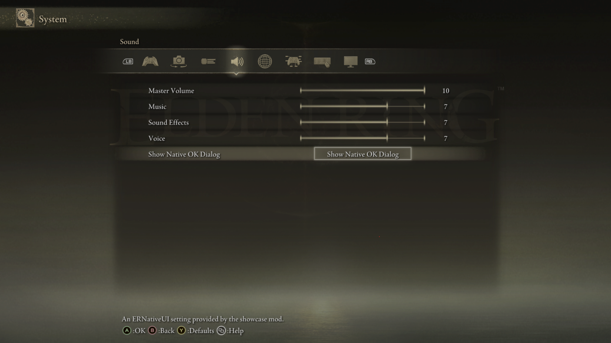

# Menus, pages, and pagination

An ERNativeUI client declares a logical menu during startup. The shared host
copies that declaration, merges it with every other provider, and presents it
through Elden Ring's native Configuration UI. Client mods never receive a game
page pointer and do not create their own hooks.

This guide uses the current API 1.1 C++17 wrapper. Begin with the
[setup guide](../getting-started/setup.md) and
[first client mod](../getting-started/first-mod.md) if the connection and
registration lifecycle is not yet familiar.

## Choose a destination

`menu.root()` is the shared **Game Options** destination. Despite the internal
GFX name `ControllSetting`, it is not Elden Ring's separate Controller
Settings screen.

API 1.1 also exposes these ordinary built-in destinations:

| Player-facing destination | C++ value |
|---|---|
| Game Options | `menu.root()` or `BuiltinPage::game_options` |
| Camera Options | `BuiltinPage::camera_options` |
| Display | `BuiltinPage::display` |
| Sound | `BuiltinPage::sound` |
| Network | `BuiltinPage::network` |
| Keyboard/Mouse Settings | `BuiltinPage::keyboard_mouse` |
| Graphics | `BuiltinPage::graphics` |

Use `Menu::page` to place rows on one of them:

```cpp
connection.value().register_menu(options, [](erui::Menu& menu) {
    auto game = menu.root();
    game.add_button<&apply_settings>(
        L"Apply",
        L"Apply every setting owned by this mod.");

    auto sound = menu.page(erui::BuiltinPage::sound);
    sound.add_toggle(
        L"Extra Ambience",
        L"Enable this mod's additional ambience.",
        1,
        &ambience_changed);
});
```

The returned `Page` is a provider-owned logical handle. It accepts the same
ordinary row builders as the root. Each built-in destination is resolved,
validated, and paginated independently at runtime.

This is the API contract. The release matrix exercises action rows on every
built-in destination. TextInput and ColorPicker have direct live evidence on
the Game Options root and provider-owned subpages; recheck those two controls
on any additional built-in destination used by a mod until that destination's
combination is added to the release matrix.

Controller Settings is intentionally absent from `BuiltinPage`: it is a
specialized remapping interface, not an ordinary settings panel. Add native
controller actions through the [input-bindings API](input-bindings.md)
instead.



*Built-in destinations accept the same provider-owned rows as Game Options.*

## Create provider-owned submenus

`Page::add_submenu` adds an action row and returns the child page to populate:

```cpp
auto advanced = menu.root().add_submenu(
    L"Advanced",
    L"Open this mod's advanced settings.",
    L"My Mod - Advanced",
    L"Configure advanced behavior.");

erui::SliderOptions intensity{};
intensity.minimum = 0;
intensity.maximum = 100;
intensity.step = 5;
intensity.initial_value = 50;

advanced.add_slider(
    L"Intensity",
    L"Adjust the effect strength.",
    intensity,
    &intensity_changed);
```

The optional third and fourth arguments are the child page title and help. An
empty child title falls back to the row label; empty child help falls back to
the row help. Submenus may contain further submenus.

A disabled submenu is omitted from materialization because Elden Ring's
validated action-row constructor has no safe disabled presentation. It does
not reserve a pagination slot.

For every argument, default, lifetime rule, and its strict-C descriptor, see
the dedicated [Submenu control reference](controls/submenu.md).

## Let the host paginate

Declare logical content in the order it should appear and do not add your own
Previous or Next rows. ERNativeUI reads the live visual capacity of the native
panel, subtracts its existing game rows, merges provider content, and creates
as many physical slices as required.

For a page with capacity `C`, the general shape is:

```text
first slice:   up to C - 1 content rows + Next
middle slice:  Previous + up to C - 2 content rows + Next
final slice:   Previous + up to C - 1 content rows
```

When every content row fits, no pagination row is added. Previous uses Elden
Ring's real asynchronous page-pop path, so the game restores its own parent
state rather than ERNativeUI imitating a Back animation.


*ERNativeUI adds native Previous and Next actions only when the logical page
needs more than one physical slice.*

The optional 13-row GFX expands Game Options and Camera Options, but it is not
a runtime requirement. Without it, the host uses the native capacity. A
completely full built-in panel cannot display provider content or a Next row;
Camera Options is full on the currently tested native layout. See
[presentation and optional GFX](presentation-and-gfx.md).

## Understand ordering and merging

Providers are ordered globally by:

1. ascending `ProviderOptions::root_priority`;
2. provider ID; then
3. registration order as the final deterministic tie-breaker.

Rows retain insertion order within each provider and destination. This rule is
also used for provider input-binding sections. A priority is an ordering hint,
not exclusive ownership of a page.

Use a stable provider ID such as `my-mod`. It may contain 1..255 ASCII letters,
digits, `.`, `_`, or `-`; it is case-sensitive and must not be localized or
changed between ordinary releases. Do not try to coordinate positions with
another mod through guessed row counts: the host performs the merge and
pagination after registration closes.

## Page titles

Provider submenus may customize their outer menu title and logical page title:

```cpp
advanced.set_presentation(
    L"My Mod",
    L"Advanced Settings");
```

When a submenu spans several slices, the default physical title is
`Advanced Settings (n/t)`. A custom formatter can replace the complete
per-slice result. The shared Game Options root keeps Elden Ring's outer
**Configuration** title, and its continuation pages use **ERNativeUI** so the
player can distinguish framework-owned pages from the game.

Formatters run during startup compilation, receive borrowed input, and write
to a bounded host buffer. A failure, empty result, invalid UTF-16, or oversized
result selects the safe default. See
[presentation and optional GFX](presentation-and-gfx.md) for a complete
formatter example.

## Registration is structural and one-time

The builder runs only during the bounded startup registration phase. Pages,
rows, labels, help text, callbacks, and topology are immutable after commit.
Runtime code may update the values of supported rows through the retained
`Registration`, but it cannot add or remove rows.

The host copies descriptor strings before each builder call returns. Callback
code and callback state have the longer lifetime documented in
[lifecycle, errors, and limits](../reference/lifecycle-errors-and-limits.md).

If any builder operation fails, the C++ wrapper records the first error and
aborts the draft instead of publishing a partial provider. Always inspect the
returned `RegistrationResult`.

## Current boundary

API 1.1 supports provider content in the destinations listed above and in
Advanced Settings-style child pages. It does not yet expose custom top-level
tabs, arbitrary Site of Grace entries, reuse of any game page family, or
provider-authored GFX movies loaded at runtime. Those are explicitly
[future research targets](../features.md#future-api-research-not-currently-supported),
not hidden API 1.1 features.

The [settings pages, pagination, and native Back case study](../research/case-studies/settings-pages-and-pagination.md)
records the exact-build evidence, failed candidates, bounded live probes, and
production validation behind this feature.
